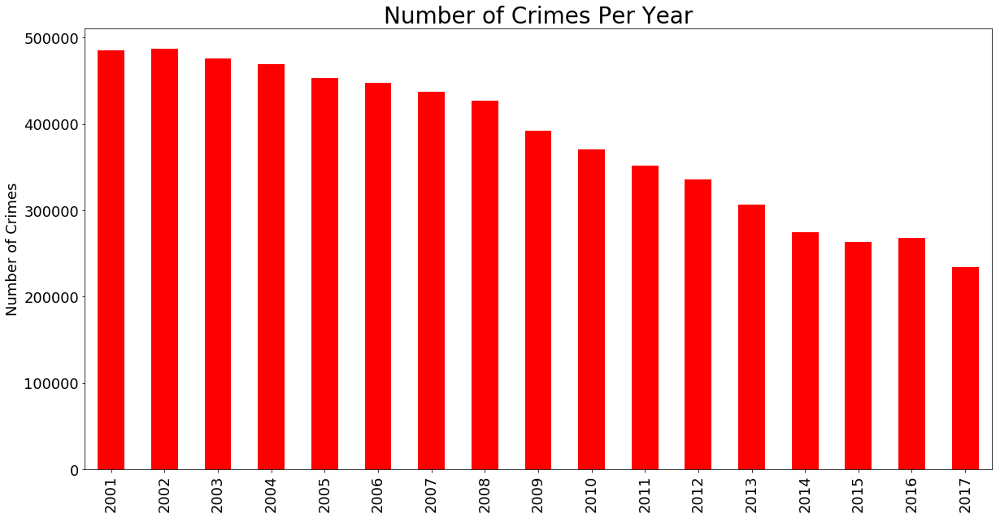
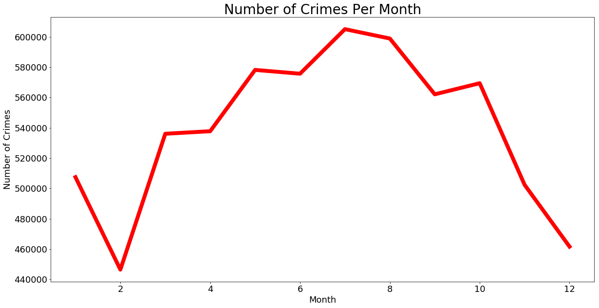
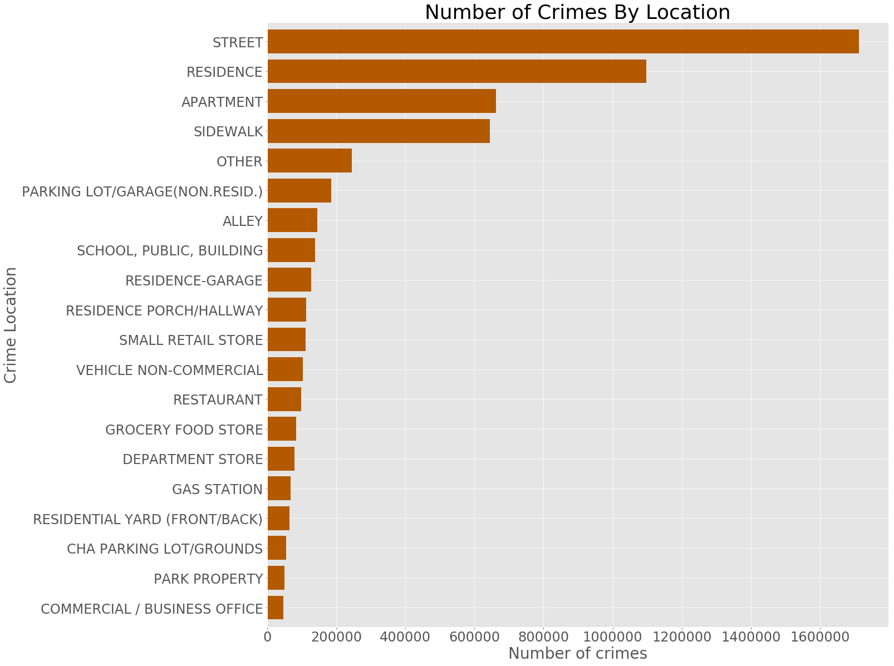
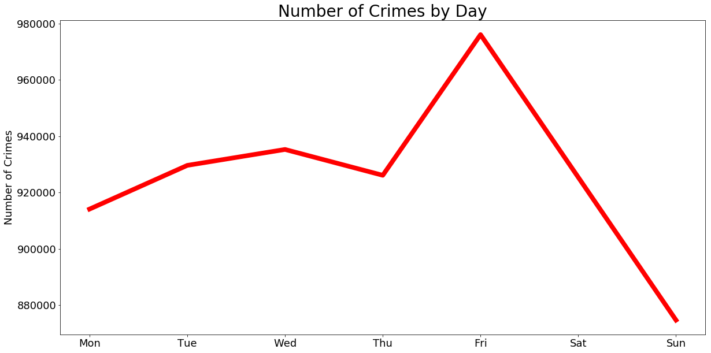
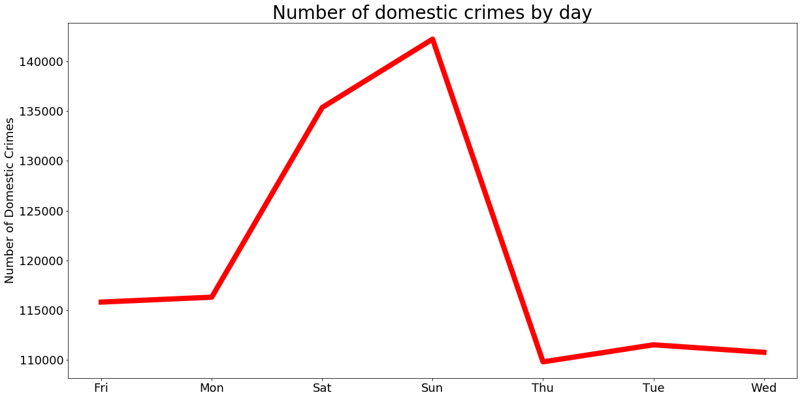
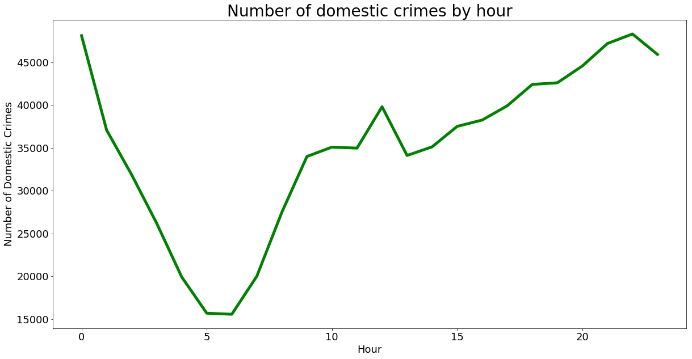
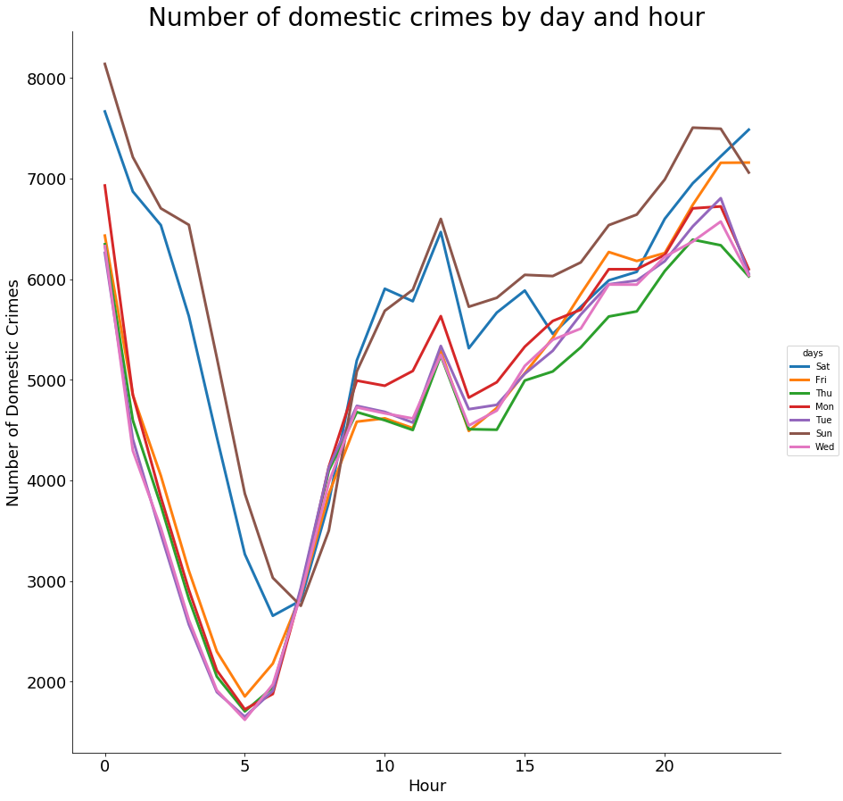

### Spark DataFrames: Exploring Chicago Crimes

In this tutorial we will analyze crimes data from [data.gov](https://data.cityofchicago.org/api/views/ijzp-q8t2/rows.csv?accessType=DOWNLOAD). The dataset reflects reported incidents of crime (with the exception of murders where data exists for each victim) that occurred in the City of Chicago since 2001.

A SparkSession can be used create DataFrame, register DataFrame as tables,
execute SQL over tables, cache tables, and read parquet files.


```python
from pyspark.sql import SparkSession
spark = SparkSession.builder.appName("Chicago_crime_analysis").getOrCreate()
```

We can let Spark infer the schema of our csv data but proving pre-defined schema makes the reading process faster. Further,it helps us to make the colum names to have the format we want, for example, to avoid spaces in the names of the columns.


```python
from pyspark.sql.types import  (StructType, 
                                StructField, 
                                DateType, 
                                BooleanType,
                                DoubleType,
                                IntegerType,
                                StringType,
                               TimestampType)


crimes_schema = StructType([StructField("ID", StringType(), True),
                            StructField("CaseNumber", StringType(), True),
                            StructField("Date", StringType(), True ),
                            StructField("Block", StringType(), True),
                            StructField("IUCR", StringType(), True),
                            StructField("PrimaryType", StringType(), True  ),
                            StructField("Description", StringType(), True ),
                            StructField("LocationDescription", StringType(), True ),
                            StructField("Arrest", BooleanType(), True),
                            StructField("Domestic", BooleanType(), True),
                            StructField("Beat", StringType(), True),
                            StructField("District", StringType(), True),
                            StructField("Ward", StringType(), True),
                            StructField("CommunityArea", StringType(), True),
                            StructField("FBICode", StringType(), True ),
                            StructField("XCoordinate", DoubleType(), True),
                            StructField("YCoordinate", DoubleType(), True ),
                            StructField("Year", IntegerType(), True),
                            StructField("UpdatedOn", DateType(), True ),
                            StructField("Latitude", DoubleType(), True),
                            StructField("Longitude", DoubleType(), True),
                            StructField("Location", StringType(), True )
                            ])
```

#### create crimes dataframe by providing the schema above.


```python
crimes = spark.read.csv("Chicago_crimes_2001_to_present.csv",
                       header = True, 
                        schema = crimes_schema)
```

First, let'se see how many rows the crimes dataframe has:


```python
print(" The crimes dataframe has {} records".format(crimes.count()))
```

     The crimes dataframe has 6481208 records


We can also see the columns, the data type of each column and the schema using the commands below.


```python
crimes.columns
```


    ['ID',
     'CaseNumber',
     'Date',
     'Block',
     'IUCR',
     'PrimaryType',
     'Description',
     'LocationDescription',
     'Arrest',
     'Domestic',
     'Beat',
     'District',
     'Ward',
     'CommunityArea',
     'FBICode',
     'XCoordinate',
     'YCoordinate',
     'Year',
     'UpdatedOn',
     'Latitude',
     'Longitude',
     'Location']


```python
crimes.dtypes
```


    [('ID', 'string'),
     ('CaseNumber', 'string'),
     ('Date', 'string'),
     ('Block', 'string'),
     ('IUCR', 'string'),
     ('PrimaryType', 'string'),
     ('Description', 'string'),
     ('LocationDescription', 'string'),
     ('Arrest', 'boolean'),
     ('Domestic', 'boolean'),
     ('Beat', 'string'),
     ('District', 'string'),
     ('Ward', 'string'),
     ('CommunityArea', 'string'),
     ('FBICode', 'string'),
     ('XCoordinate', 'double'),
     ('YCoordinate', 'double'),
     ('Year', 'int'),
     ('UpdatedOn', 'date'),
     ('Latitude', 'double'),
     ('Longitude', 'double'),
     ('Location', 'string')]


```python
crimes.printSchema()
```

    root
     |-- ID: string (nullable = true)
     |-- CaseNumber: string (nullable = true)
     |-- Date: string (nullable = true)
     |-- Block: string (nullable = true)
     |-- IUCR: string (nullable = true)
     |-- PrimaryType: string (nullable = true)
     |-- Description: string (nullable = true)
     |-- LocationDescription: string (nullable = true)
     |-- Arrest: boolean (nullable = true)
     |-- Domestic: boolean (nullable = true)
     |-- Beat: string (nullable = true)
     |-- District: string (nullable = true)
     |-- Ward: string (nullable = true)
     |-- CommunityArea: string (nullable = true)
     |-- FBICode: string (nullable = true)
     |-- XCoordinate: double (nullable = true)
     |-- YCoordinate: double (nullable = true)
     |-- Year: integer (nullable = true)
     |-- UpdatedOn: date (nullable = true)
     |-- Latitude: double (nullable = true)
     |-- Longitude: double (nullable = true)
     |-- Location: string (nullable = true)
    


We can also quickly see some rows as below.
We select one or more columns using **select**. **show** helps us to print the first n rows.


```python
crimes.select("Date").show(10, truncate = False)
```

    +----------------------+
    |Date                  |
    +----------------------+
    |01/31/2006 12:13:05 PM|
    |03/21/2006 07:00:00 PM|
    |02/09/2006 01:44:41 AM|
    |03/21/2006 04:45:00 PM|
    |03/21/2006 10:00:00 PM|
    |03/20/2006 11:00:00 PM|
    |02/01/2006 11:25:00 PM|
    |03/21/2006 02:37:00 PM|
    |02/09/2006 05:38:07 AM|
    |11/29/2005 03:10:00 PM|
    +----------------------+
    only showing top 10 rows
    


#### Change data type of a column

The **Date** column is in string format. Let's change it to timestamp format using the uder defined functions (udf).

**withColumn** helps to create a new column and we remove one or more columns with **drop**.


```python
from datetime import datetime
from pyspark.sql.functions import col,udf

myfunc =  udf(lambda x: datetime.strptime(x, '%m/%d/%Y %I:%M:%S %p'), TimestampType())
df = crimes.withColumn('Date_time', myfunc(col('Date'))).drop("Date")

df.select(df["Date_time"]).show(5)
```

    +-------------------+
    |          Date_time|
    +-------------------+
    |2006-01-31 12:13:05|
    |2006-03-21 19:00:00|
    |2006-02-09 01:44:41|
    |2006-03-21 16:45:00|
    |2006-03-21 22:00:00|
    +-------------------+
    only showing top 5 rows
    


```python
df.dtypes
```


    [('ID', 'string'),
     ('CaseNumber', 'string'),
     ('Block', 'string'),
     ('IUCR', 'string'),
     ('PrimaryType', 'string'),
     ('Description', 'string'),
     ('LocationDescription', 'string'),
     ('Arrest', 'boolean'),
     ('Domestic', 'boolean'),
     ('Beat', 'string'),
     ('District', 'string'),
     ('Ward', 'string'),
     ('CommunityArea', 'string'),
     ('FBICode', 'string'),
     ('XCoordinate', 'double'),
     ('YCoordinate', 'double'),
     ('Year', 'int'),
     ('UpdatedOn', 'date'),
     ('Latitude', 'double'),
     ('Longitude', 'double'),
     ('Location', 'string'),
     ('Date_time', 'timestamp')]


### Calculate statistics of numeric and string columns

We can calculate the statistics of string and numeric columns using **describe**. When we select more than one columns, we have to pass the column names a python list.


```python
crimes.select(["Latitude","Longitude","Year","XCoordinate","YCoordinate"]).describe().show()
```

    +-------+-------------------+-------------------+------------------+------------------+------------------+
    |summary|           Latitude|          Longitude|              Year|       XCoordinate|       YCoordinate|
    +-------+-------------------+-------------------+------------------+------------------+------------------+
    |  count|            6393147|            6393147|           6479775|           6393147|           6393147|
    |   mean|  41.84186221474304| -87.67189839071902|2007.9269172154898|1164490.5803256205|1885665.2150490205|
    | stddev|0.09076954083441872|0.06277083346349299| 4.712584642906088|17364.095200290543|32982.572778759975|
    |    min|       36.619446395|      -91.686565684|              2001|               0.0|               0.0|
    |    max|       42.022910333|      -87.524529378|              2017|         1205119.0|         1951622.0|
    +-------+-------------------+-------------------+------------------+------------------+------------------+
    


The above numbers are ugly. Let's round them using the **format_number** from the functions.


```python
from pyspark.sql.functions import format_number
```


```python
result = crimes.select(["Latitude","Longitude","Year","XCoordinate","YCoordinate"]).describe()
result.select(result['summary'],
              format_number(result['Latitude'].cast('float'),2).alias('Latitude'),
              format_number(result['Longitude'].cast('float'),2).alias('Longitude'),
              result['Year'].cast('int').alias('year'),
              format_number(result['XCoordinate'].cast('float'),2).alias('XCoordinate'),
              format_number(result['YCoordinate'].cast('float'),2).alias('YCoordinate')
             ).show()
```

    +-------+------------+------------+-------+------------+------------+
    |summary|    Latitude|   Longitude|   year| XCoordinate| YCoordinate|
    +-------+------------+------------+-------+------------+------------+
    |  count|6,394,450.00|6,394,450.00|6481208|6,394,450.00|6,394,450.00|
    |   mean|       41.84|      -87.67|   2007|1,164,490.62|1,885,665.88|
    | stddev|        0.09|        0.06|      4|   17,363.81|   32,982.29|
    |    min|       36.62|      -91.69|   2001|        0.00|        0.00|
    |    max|       42.02|      -87.52|   2017|1,205,119.00|1,951,622.00|
    +-------+------------+------------+-------+------------+------------+
    


#### How many primary crime types are there?

**distinct** returns distinct elements.


```python
crimes.select("PrimaryType").distinct().count()
```


    35


We can also see a list of the primary crime types.


```python
crimes.select("PrimaryType").distinct().show(n = 35)
```

    +--------------------+
    |         PrimaryType|
    +--------------------+
    |OFFENSE INVOLVING...|
    |            STALKING|
    |PUBLIC PEACE VIOL...|
    |           OBSCENITY|
    |NON-CRIMINAL (SUB...|
    |               ARSON|
    |   DOMESTIC VIOLENCE|
    |            GAMBLING|
    |   CRIMINAL TRESPASS|
    |             ASSAULT|
    |      NON - CRIMINAL|
    |LIQUOR LAW VIOLATION|
    | MOTOR VEHICLE THEFT|
    |               THEFT|
    |             BATTERY|
    |             ROBBERY|
    |            HOMICIDE|
    |           RITUALISM|
    |    PUBLIC INDECENCY|
    | CRIM SEXUAL ASSAULT|
    |   HUMAN TRAFFICKING|
    |        INTIMIDATION|
    |        PROSTITUTION|
    |  DECEPTIVE PRACTICE|
    |CONCEALED CARRY L...|
    |         SEX OFFENSE|
    |     CRIMINAL DAMAGE|
    |           NARCOTICS|
    |        NON-CRIMINAL|
    |       OTHER OFFENSE|
    |          KIDNAPPING|
    |            BURGLARY|
    |   WEAPONS VIOLATION|
    |OTHER NARCOTIC VI...|
    |INTERFERENCE WITH...|
    +--------------------+
    


#### How many homicides are there in the dataset?


```python
crimes.where(crimes["PrimaryType"] == "HOMICIDE").count()
```


    8847


#### how many domestic assualts there are?


Make sure to add in the parenthesis separating the statements!


```python
crimes.filter((crimes["PrimaryType"] == "ASSAULT") & (crimes["Domestic"] == "True")).count()
```


    86552


We can use **filter** or **where** to do filtering.


```python
columns = ['PrimaryType', 'Description', 'Arrest', 'Domestic']

crimes.where((crimes["PrimaryType"] == "HOMICIDE") & (crimes["Arrest"] == "true"))\
                                                        .select(columns).show(10)
```

    +-----------+-------------------+------+--------+
    |PrimaryType|        Description|Arrest|Domestic|
    +-----------+-------------------+------+--------+
    |   HOMICIDE|FIRST DEGREE MURDER|  true|    true|
    |   HOMICIDE|FIRST DEGREE MURDER|  true|   false|
    |   HOMICIDE|FIRST DEGREE MURDER|  true|   false|
    |   HOMICIDE|FIRST DEGREE MURDER|  true|   false|
    |   HOMICIDE|FIRST DEGREE MURDER|  true|   false|
    |   HOMICIDE|FIRST DEGREE MURDER|  true|   false|
    |   HOMICIDE|FIRST DEGREE MURDER|  true|   false|
    |   HOMICIDE|FIRST DEGREE MURDER|  true|   false|
    |   HOMICIDE|FIRST DEGREE MURDER|  true|   false|
    |   HOMICIDE|FIRST DEGREE MURDER|  true|    true|
    +-----------+-------------------+------+--------+
    only showing top 10 rows
    


We can use **limit** to limit the number of columns we want to retrieve from a dataframe.


```python
crimes.select(columns).limit(10). show(truncate = True)
```

    +-------------------+--------------------+------+--------+
    |        PrimaryType|         Description|Arrest|Domestic|
    +-------------------+--------------------+------+--------+
    |          NARCOTICS|POSS: CANNABIS 30...|  true|   false|
    |  CRIMINAL TRESPASS|             TO LAND|  true|   false|
    |          NARCOTICS|POSS: CANNABIS 30...|  true|   false|
    |              THEFT|           OVER $500| false|   false|
    |              THEFT|      $500 AND UNDER| false|   false|
    |MOTOR VEHICLE THEFT|          AUTOMOBILE| false|   false|
    |          NARCOTICS|         POSS: CRACK|  true|   false|
    |    CRIMINAL DAMAGE|         TO PROPERTY| false|   false|
    |       PROSTITUTION|SOLICIT FOR PROST...|  true|   false|
    |    CRIMINAL DAMAGE|   TO STATE SUP PROP| false|   false|
    +-------------------+--------------------+------+--------+
    


```python
lat_max = crimes.agg({"Latitude" : "max"}).collect()[0][0]

print("The maximum latitude values is {}".format(lat_max))

```

    The maximum latitude values is 42.022910333


#### Create a new column with withColumn

Let's subtract each latitude value from the maximum latitude.


```python
df = crimes.withColumn("difference_from_max_lat",lat_max - crimes["Latitude"])
```


```python
df.select(["Latitude", "difference_from_max_lat"]).show(5)
```

    +------------+-----------------------+
    |    Latitude|difference_from_max_lat|
    +------------+-----------------------+
    |42.002478396|     0.0204319369999979|
    |41.780595495|    0.24231483799999864|
    |41.787955143|    0.23495519000000087|
    |41.901774026|    0.12113630700000044|
    |41.748674558|    0.27423577500000107|
    +------------+-----------------------+
    only showing top 5 rows
    


#### Rename a column with withColumnRenamed

Let's rename Latitude to Lat.


```python
df = crimes.withColumnRenamed("Latitude", "Lat")
df.columns
```


    ['ID',
     'CaseNumber',
     'Date',
     'Block',
     'IUCR',
     'PrimaryType',
     'Description',
     'LocationDescription',
     'Arrest',
     'Domestic',
     'Beat',
     'District',
     'Ward',
     'CommunityArea',
     'FBICode',
     'XCoordinate',
     'YCoordinate',
     'Year',
     'UpdatedOn',
     'Lat',
     'Longitude',
     'Location']


```python
columns = ['PrimaryType', 'Description', 'Arrest', 'Domestic','Lat']

df.orderBy(df["Lat"].desc()).select(columns).show(10)
```

    +-------------------+--------------------+------+--------+------------+
    |        PrimaryType|         Description|Arrest|Domestic|         Lat|
    +-------------------+--------------------+------+--------+------------+
    |              THEFT|      $500 AND UNDER| false|   false|42.022910333|
    |MOTOR VEHICLE THEFT|          AUTOMOBILE| false|   false|42.022878225|
    |           BURGLARY|      UNLAWFUL ENTRY| false|   false|42.022709624|
    |              THEFT|      POCKET-PICKING| false|   false|42.022671246|
    |              THEFT|      $500 AND UNDER| false|   false|42.022671246|
    |      OTHER OFFENSE|    PAROLE VIOLATION|  true|   false|42.022671246|
    |    CRIMINAL DAMAGE|          TO VEHICLE| false|   false|42.022653914|
    |            BATTERY|              SIMPLE| false|    true|42.022644813|
    |          NARCOTICS|POSS: CANNABIS 30...|  true|   false|42.022644813|
    |      OTHER OFFENSE|    TELEPHONE THREAT| false|    true|42.022644369|
    +-------------------+--------------------+------+--------+------------+
    only showing top 10 rows
    


### Use Spark's functions to calculate various statistics

Calculate average latitude value.


```python
from pyspark.sql.functions import mean
df.select(mean("Lat")).alias("Mean Latitude").show()
```

    +-----------------+
    |         avg(Lat)|
    +-----------------+
    |41.84186221474304|
    +-----------------+
    


We can also use the **agg** method to calculate the average.


```python
df.agg({"Lat":"avg"}).show()
```

    +------------------+
    |          avg(Lat)|
    +------------------+
    |41.841863914298415|
    +------------------+
    


#### We can also calculate maximum and minimum values using functions from pyspark.


```python
from pyspark.sql.functions import max,min
```


```python
df.select(max("Xcoordinate"),min("Xcoordinate")).show()
```

    +----------------+----------------+
    |max(Xcoordinate)|min(Xcoordinate)|
    +----------------+----------------+
    |       1205119.0|             0.0|
    +----------------+----------------+
    


#### What percentage of the crimes are domestic


```python
df.filter(df["Domestic"]==True).count()/df.count() * 100
```


    12.988412036768453


#### What is the Pearson correlation between Lat and Ycoordinate?


```python
from pyspark.sql.functions import corr
df.select(corr("Lat","Ycoordinate")).show()
```

    +----------------------+
    |corr(Lat, Ycoordinate)|
    +----------------------+
    |    0.9999931390763287|
    +----------------------+
    


#### Find the number of crimes per year


```python
df.groupBy("Year").count().show()
```

    +----+------+
    |Year| count|
    +----+------+
    |2003|475921|
    |2007|436966|
    |2015|263496|
    |2006|448066|
    |2013|306846|
    |2014|274839|
    |2004|469362|
    |2012|335798|
    |2009|392601|
    |2016|268160|
    |2001|485735|
    |2005|453687|
    |2010|370230|
    |2011|351654|
    |2008|427000|
    |2017|232670|
    |2002|486744|
    +----+------+
    


```python
df.groupBy("Year").count().collect()
```


    [Row(Year=2003, count=475921),
     Row(Year=2007, count=436966),
     Row(Year=2015, count=263496),
     Row(Year=2006, count=448066),
     Row(Year=2013, count=306846),
     Row(Year=2014, count=274839),
     Row(Year=2004, count=469362),
     Row(Year=2012, count=335798),
     Row(Year=2009, count=392601),
     Row(Year=2016, count=268160),
     Row(Year=2001, count=485735),
     Row(Year=2005, count=453687),
     Row(Year=2010, count=370230),
     Row(Year=2011, count=351654),
     Row(Year=2008, count=427000),
     Row(Year=2017, count=232670),
     Row(Year=2002, count=486744)]


####    We can also use matplotlib and Pandas to visualize  the total number of crimes per year


```python
count = [item[1] for item in df.groupBy("Year").count().collect()]
year = [item[0] for item in df.groupBy("Year").count().collect()]
```


```python
number_of_crimes_per_year = {"count":count, "year" : year}
```


```python
import pandas as pd
import matplotlib.pyplot as plt
%matplotlib inline
```


```python
number_of_crimes_per_year = pd.DataFrame(number_of_crimes_per_year)
```


```python
number_of_crimes_per_year.head()
```


<div>
<style scoped>
    .dataframe tbody tr th:only-of-type {
        vertical-align: middle;
    }

    .dataframe tbody tr th {
        vertical-align: top;
    }

    .dataframe thead th {
        text-align: right;
    }
</style>
<table border="1" class="dataframe">
  <thead>
    <tr style="text-align: right;">
      <th></th>
      <th>count</th>
      <th>year</th>
    </tr>
  </thead>
  <tbody>
    <tr>
      <th>0</th>
      <td>475921</td>
      <td>2003</td>
    </tr>
    <tr>
      <th>1</th>
      <td>436966</td>
      <td>2007</td>
    </tr>
    <tr>
      <th>2</th>
      <td>263495</td>
      <td>2015</td>
    </tr>
    <tr>
      <th>3</th>
      <td>448066</td>
      <td>2006</td>
    </tr>
    <tr>
      <th>4</th>
      <td>306847</td>
      <td>2013</td>
    </tr>
  </tbody>
</table>
</div>


```python
number_of_crimes_per_year = number_of_crimes_per_year.sort_values(by = "year")

number_of_crimes_per_year.plot(figsize = (20,10), kind = "bar", color = "red",
                               x = "year", y = "count", legend = False)

plt.xlabel("", fontsize = 18)
plt.ylabel("Number of Crimes", fontsize = 18)
plt.title("Number of Crimes Per Year", fontsize = 28)
plt.xticks(size = 18)
plt.yticks(size = 18)
plt.show()
```





#### Plot number of crimes by month

we can use the month function from PySpark's functions to get the numeric month.


```python
from pyspark.sql.functions import month
monthdf = df.withColumn("Month",month("Date_time"))
monthCounts = monthdf.select("Month").groupBy("Month").count()
monthCounts.show()
```

    +-----+------+
    |Month| count|
    +-----+------+
    |   12|461611|
    |    1|507455|
    |    6|575702|
    |    3|536081|
    |    5|578211|
    |    9|562105|
    |    4|537761|
    |    8|598914|
    |    7|605102|
    |   10|569435|
    |   11|502385|
    |    2|446446|
    +-----+------+
    


```python
monthCounts = monthCounts.collect()

months = [item[0] for item in monthCounts]

count = [item[1] for item in monthCounts]

crimes_per_month = {"month":months, "crime_count": count}
crimes_per_month = pd.DataFrame(crimes_per_month)


crimes_per_month = crimes_per_month.sort_values(by = "month")

crimes_per_month.plot(figsize = (20,10), kind = "line", x = "month", y = "crime_count", 
                      color = "red", linewidth = 8, legend = False)

plt.xlabel("Month", fontsize = 18)
plt.ylabel("Number of Crimes", fontsize = 18)
plt.title("Number of Crimes Per Month", fontsize = 28)
plt.xticks(size = 18)
plt.yticks(size = 18)
plt.show()
```





### Where do most crimes take pace?


```python
crimes.groupBy("LocationDescription").count().show()
```

    +--------------------+------+
    | LocationDescription| count|
    +--------------------+------+
    |   RAILROAD PROPERTY|    13|
    |AIRPORT TERMINAL ...|  1417|
    |EXPRESSWAY EMBANK...|     1|
    |POLICE FACILITY/V...| 16518|
    |               MOTEL|     5|
    |            SIDEWALK|644570|
    |AIRPORT TERMINAL ...|    67|
    |PUBLIC GRAMMAR SC...|     1|
    |CTA GARAGE / OTHE...|  9660|
    |            CAR WASH|  2632|
    |   TRUCKING TERMINAL|     1|
    |    AIRPORT/AIRCRAFT| 16060|
    |            HOSPITAL|     5|
    |MEDICAL/DENTAL OF...|  6836|
    |    FEDERAL BUILDING|   736|
    |             TRAILER|     3|
    |SCHOOL, PUBLIC, G...| 27969|
    |         CTA STATION|  2760|
    |SPORTS ARENA/STADIUM|  4733|
    |               HOUSE|   497|
    +--------------------+------+
    only showing top 20 rows
    


```python
crime_location  = crimes.groupBy("LocationDescription").count().collect()
location = [item[0] for item in crime_location]
count = [item[1] for item in crime_location]
crime_location = {"location" : location, "count": count}
crime_location = pd.DataFrame(crime_location)
crime_location = crime_location.sort_values(by = "count", ascending  = False)
crime_location.iloc[:5]
```


<div>
<style scoped>
    .dataframe tbody tr th:only-of-type {
        vertical-align: middle;
    }

    .dataframe tbody tr th {
        vertical-align: top;
    }

    .dataframe thead th {
        text-align: right;
    }
</style>
<table border="1" class="dataframe">
  <thead>
    <tr style="text-align: right;">
      <th></th>
      <th>count</th>
      <th>location</th>
    </tr>
  </thead>
  <tbody>
    <tr>
      <th>58</th>
      <td>1711956</td>
      <td>STREET</td>
    </tr>
    <tr>
      <th>95</th>
      <td>1097012</td>
      <td>RESIDENCE</td>
    </tr>
    <tr>
      <th>125</th>
      <td>662880</td>
      <td>APARTMENT</td>
    </tr>
    <tr>
      <th>5</th>
      <td>644570</td>
      <td>SIDEWALK</td>
    </tr>
    <tr>
      <th>126</th>
      <td>245385</td>
      <td>OTHER</td>
    </tr>
  </tbody>
</table>
</div>


```python
crime_location = crime_location.iloc[:20]

myplot = crime_location .plot(figsize = (20,20), kind = "barh", color = "#b35900", width = 0.8,
                               x = "location", y = "count", legend = False)

myplot.invert_yaxis()

plt.xlabel("Number of crimes", fontsize = 28)
plt.ylabel("Crime Location", fontsize = 28)
plt.title("Number of Crimes By Location", fontsize = 36)
plt.xticks(size = 24)
plt.yticks(size = 24)
plt.show()
```





####     We can also calculate the number of crimes per hour, day, and month.

Let's add day of week and hour of day columns using the date_format.


```python
from pyspark.sql.functions import date_format
df = df.withColumn("DayOfWeek", date_format("Date_time","E")).\
      withColumn("DayOfWeek_number", date_format("Date_time","u")).\
      withColumn("HourOfDay", date_format("Date_time","H"))
weekDaysCount  = df.groupBy(["DayOfWeek", "DayOfWeek_number"]).count()
weekDaysCount.show()
```

    +---------+----------------+------+
    |DayOfWeek|DayOfWeek_number| count|
    +---------+----------------+------+
    |      Fri|               5|976064|
    |      Wed|               3|935274|
    |      Sat|               6|925385|
    |      Tue|               2|929622|
    |      Mon|               1|914099|
    |      Sun|               7|874663|
    |      Thu|               4|926101|
    +---------+----------------+------+
    


We can also print the schema to see the columns.


```python
df.printSchema()
```

    root
     |-- ID: string (nullable = true)
     |-- CaseNumber: string (nullable = true)
     |-- Block: string (nullable = true)
     |-- IUCR: string (nullable = true)
     |-- PrimaryType: string (nullable = true)
     |-- Description: string (nullable = true)
     |-- LocationDescription: string (nullable = true)
     |-- Arrest: boolean (nullable = true)
     |-- Domestic: boolean (nullable = true)
     |-- Beat: string (nullable = true)
     |-- District: string (nullable = true)
     |-- Ward: string (nullable = true)
     |-- CommunityArea: string (nullable = true)
     |-- FBICode: string (nullable = true)
     |-- XCoordinate: double (nullable = true)
     |-- YCoordinate: double (nullable = true)
     |-- Year: integer (nullable = true)
     |-- UpdatedOn: date (nullable = true)
     |-- Latitude: double (nullable = true)
     |-- Longitude: double (nullable = true)
     |-- Location: string (nullable = true)
     |-- Date_time: timestamp (nullable = true)
     |-- DayOfWeek: string (nullable = true)
     |-- DayOfWeek_number: string (nullable = true)
     |-- HourOfDay: string (nullable = true)
    


#### Which days have the highest number of crimes?


```python
weekDaysCount  = df.groupBy(["DayOfWeek", "DayOfWeek_number"]).count().collect()
days = [item[0] for item in weekDaysCount]
count = [item[2] for item in weekDaysCount]
day_number = [item[1] for item in weekDaysCount]
crime_byDay = {"days" : days, "count": count, "day_number": day_number}
crime_byDay = pd.DataFrame(crime_byDay)
crime_byDay = crime_byDay.sort_values(by = "day_number", ascending  = True)


crime_byDay.plot(figsize = (20,10), kind = "line", x = "days", y = "count", 
                      color = "red", linewidth = 8, legend = False)

plt.ylabel("Number of Crimes", fontsize = 18)
plt.xlabel("")
plt.title("Number of Crimes by Day", fontsize = 28)
plt.xticks(size = 18)
plt.yticks(size = 18)
plt.show()

```





#### we can also show only number of domestic crimes by day


```python
weekDaysCount  = df.filter(df["Domestic"] == "true").groupBy(["DayOfWeek", "DayOfWeek_number"]).count().collect()
days = [item[0] for item in weekDaysCount]
count = [item[2] for item in weekDaysCount]
day_number = [item[1] for item in weekDaysCount]
crime_byDay = {"days" : days, "count": count, "day_number": day_number}
crime_byDay = pd.DataFrame(crime_byDay)
crime_byDay = crime_byDay.sort_values(by = "days", ascending  = True)


crime_byDay.plot(figsize = (20,10), kind = "line", x = "days", y = "count", 
                      color = "red", linewidth = 8, legend = False)

plt.ylabel("Number of Domestic Crimes", fontsize = 18)
plt.xlabel("")
plt.title("Number of domestic crimes by day", fontsize = 28)
plt.xticks(size = 18)
plt.yticks(size = 18)
plt.show()
```





#### Number of domestic crimes by hour


```python
temp = df.filter(df["Domestic"] == "true")
temp = temp.select(df['HourOfDay'].cast('int').alias('HourOfDay'))
hourlyCount  = temp.groupBy(["HourOfDay"]).count().collect()

hours = [item[0] for item in hourlyCount]
count = [item[1] for item in hourlyCount]

crime_byHour = {"count": count, "hours": hours}
crime_byHour = pd.DataFrame(crime_byHour)
crime_byHour = crime_byHour.sort_values(by = "hours", ascending  = True)


crime_byHour.plot(figsize = (20,10), kind = "line", x = "hours", y = "count", 
                      color = "green", linewidth = 5, legend = False)

plt.ylabel("Number of Domestic Crimes", fontsize = 18)
plt.xlabel("Hour", fontsize = 18)
plt.title("Number of domestic crimes by hour", fontsize = 28)
plt.xticks(size = 18)
plt.yticks(size = 18)
plt.show()
```





#### We can also show number of domestic crimes by day and hour


```python
import seaborn as sns
```


```python
temp = df.filter(df["Domestic"] == "true")
temp = temp.select("DayOfWeek", df['HourOfDay'].cast('int').alias('HourOfDay'))
hourlyCount  = temp.groupBy(["DayOfWeek","HourOfDay"]).count().collect()

days = [item[0] for item in hourlyCount]
hours = [item[1] for item in hourlyCount]
count = [item[2] for item in hourlyCount]

crime_byHour = {"count": count, "hours": hours, "days": days}
crime_byHour = pd.DataFrame(crime_byHour)
crime_byHour = crime_byHour.sort_values(by = "hours", ascending  = True)

```


```python
import seaborn as sns

g = sns.FacetGrid(crime_byHour, hue="days", size = 12)
g.map(plt.plot, "hours", "count", linewidth = 3)
g.add_legend()

plt.ylabel("Number of Domestic Crimes", fontsize = 18)
plt.xlabel("Hour", fontsize = 18)
plt.title("Number of domestic crimes by day and hour", fontsize = 28)
plt.xticks(size = 18)
plt.yticks(size = 18)
plt.show()
```





### Remark

This is the second blog post on the Spark tutorial series to help people prepare for the Hortonworks Apache Spark Certification. The first one is [here]. If you want to learn/master Spark with Python or if you are preparing for a Spark Certification to show your skills in big data, keep tuned.
