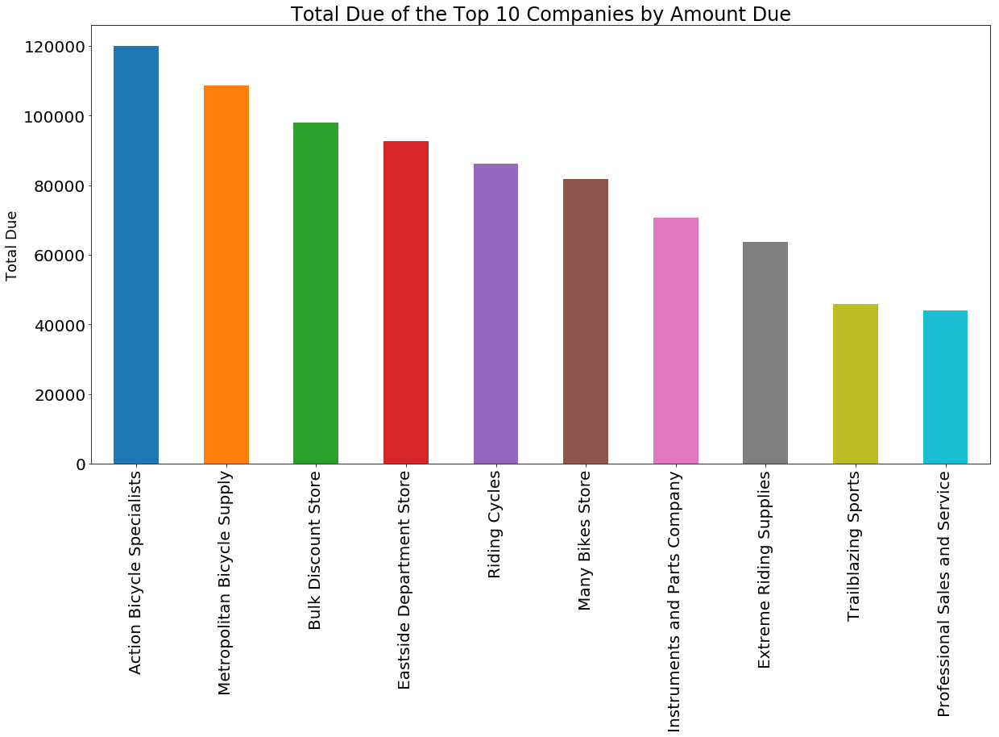
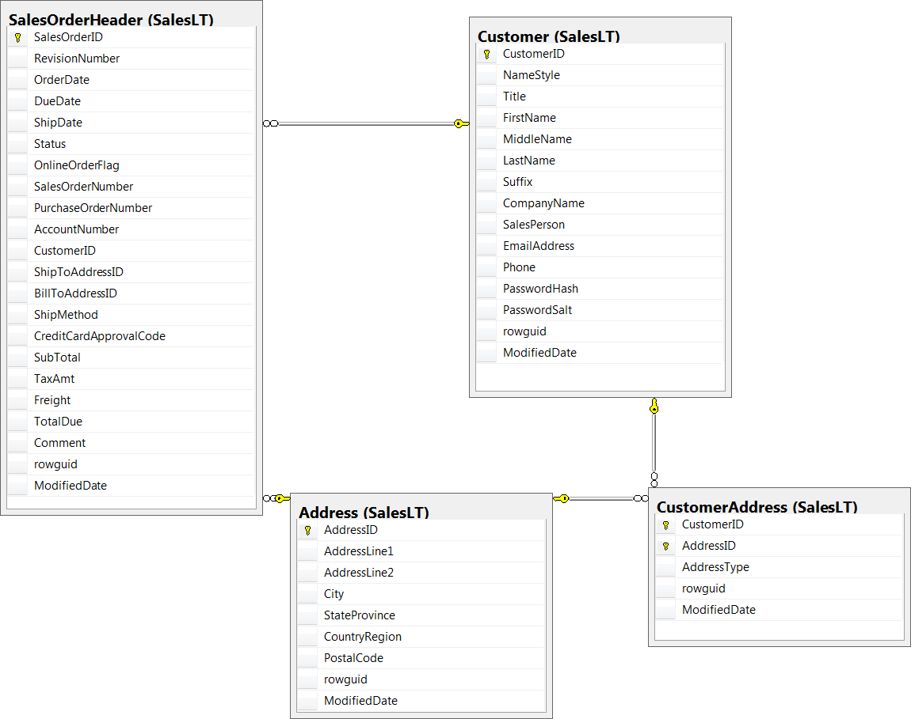

##  Spark RDDs Vs DataFrames vs SparkSQL - Part 2 : Working With Multiple Tables 

This is the second tutorial on the Spark RDDs Vs DataFrames vs SparkSQL blog post series. The first one is available [here](http://datascience-enthusiast.com/Python/DataFramesVsRDDsSpark-Part1.html). In the first part, I showed how to retrieve, sort and filter data using Spark RDDs, DataFrames and SparkSQL. In this tutorial, we will see how to work with multiple tables in Spark the RDD way, the DataFrame way and with SparkSQL. 


If you like this tutorial series, check also my other recent blos posts on Spark on [Analyzing the Bible and the Quran using Spark](http://datascience-enthusiast.com/Python/analyzing_bible_quran_with_spark.html) and [Spark DataFrames: Exploring Chicago Crimes](http://datascience-enthusiast.com/Python/SparkDataFrames-ExploringChicagoCrimes.html). The data and the notebooks can be downloaded from my [GitHub repository](https://github.com/fissehab/Spark_certification). The size of the data is not large, however, the same code works for large volume as well. Therefore, we can practice with this dataset to master the functinalities of Spark.

For this tutorial, we will work with the **SalesLTProduct.txt**,**SalesLTSalesOrderHeader.txt**, **SalesLTCustomer.txt**,**SalesLTAddress.txt** and **SalesLTCustomerAddress.txt** datasets. Let's answer a couple of questions using Spark Resilient Distiributed (RDD) way, DataFrame way and SparkSQL.

SparkContext is main entry point for Spark functionality.


```python
from pyspark import SparkContext, SparkConf
from pyspark.sql import SQLContext


conf = SparkConf().setAppName("miniProject").setMaster("local[*]")
sc = SparkContext.getOrCreate(conf)

sqlcontext = SQLContext(sc)
```

### 1. Retrieve customer orders
As an initial step towards generating invoice report, write a query that returns the company name from the SalesLTCustomer.txt, and the sales order ID and total due from the SalesLTSalesOrderHeader.txt.


** RDD way**


```python
orderHeader = sc.textFile("SalesLTSalesOrderHeader.txt")
customer = sc.textFile("SalesLTCustomer.txt")
```

From the commnads below, we see that the first rows are column names and the datasets are tab delimited.


```python
orderHeader.first()
```


    'SalesOrderID\tRevisionNumber\tOrderDate\tDueDate\tShipDate\tStatus\tOnlineOrderFlag\tSalesOrderNumber\tPurchaseOrderNumber\tAccountNumber\tCustomerID\tShipToAddressID\tBillToAddressID\tShipMethod\tCreditCardApprovalCode\tSubTotal\tTaxAmt\tFreight\tTotalDue\tComment\trowguid\tModifiedDate'


```python
customer.first()
```


    'CustomerID\tNameStyle\tTitle\tFirstName\tMiddleName\tLastName\tSuffix\tCompanyName\tSalesPerson\tEmailAddress\tPhone\tPasswordHash\tPasswordSalt\trowguid\tModifiedDate'


Now, let's have the column names and the contents separated.


```python
customer_header = customer.first()
customer_rdd = customer.filter(lambda line: line != customer_header)

orderHeader_header = orderHeader.first()
orderHeader_rdd = orderHeader.filter(lambda line: line != orderHeader_header)
```

customer_rdd and orderHeader_rdd are tab delimited as we can see it below.


```python
customer_rdd.first()
```


    '1\t0\tMr.\tOrlando\tN.\tGee\tNULL\tA Bike Store\tadventure-works\\pamela0\torlando0@adventure-works.com\t245-555-0173\tL/Rlwxzp4w7RWmEgXX+/A7cXaePEPcp+KwQhl2fJL7w=\t1KjXYs4=\t3F5AE95E-B87D-4AED-95B4-C3797AFCB74F\t2001-08-01 00:00:00.000'


We need only CustomerID and ComapanyName from the customers RDD. From the orderHeader RDD we need CustomerID,SalesOrderID and TotalDue then we are joining the two RDD using inner join.Finally, we are displaying 10 companies with the highest amout due.


```python
customer_rdd1 = customer_rdd.map(lambda line: (line.split("\t")[0], #CustomerID
                                               line.split("\t")[7]  #CompanyName
                                              ))

orderHeader_rdd1 = orderHeader_rdd.map(lambda line: (line.split("\t")[10], #CustomerID
                                                     (line.split("\t")[0], #SalesOrderID
                                                      float(line.split("\t")[-4]) # TotalDue
                                                     )))

invoice1 = customer_rdd1.join(orderHeader_rdd1)
invoice1.takeOrdered(10, lambda x: -x[1][1][1])
```


    [('29736', ('Action Bicycle Specialists', ('71784', 119960.824))),
     ('30050', ('Metropolitan Bicycle Supply', ('71936', 108597.9536))),
     ('29546', ('Bulk Discount Store', ('71938', 98138.2131))),
     ('29957', ('Eastside Department Store', ('71783', 92663.5609))),
     ('29796', ('Riding Cycles', ('71797', 86222.8072))),
     ('29929', ('Many Bikes Store', ('71902', 81834.9826))),
     ('29932', ('Instruments and Parts Company', ('71898', 70698.9922))),
     ('29660', ('Extreme Riding Supplies', ('71796', 63686.2708))),
     ('29938', ('Trailblazing Sports', ('71845', 45992.3665))),
     ('29485', ('Professional Sales and Service', ('71782', 43962.7901)))]


If we want, once we collect the RDD resulting from our transformations and actions, we can use other Python packages to visualize our data.


```python
import pandas as pd
top10 = invoice1.takeOrdered(10, lambda x: -x[1][1][1])
companies = [x[1][0] for x in top10]
total_due = [x[1][1][1] for x in top10]
top10_dict = {"companies": companies, "total_due":total_due}
top10_pd = pd.DataFrame(top10_dict)
```


```python
import matplotlib.pyplot as plt
%matplotlib inline

top10_pd.plot(figsize = (20, 10),kind = "bar", legend  = False, x = "companies", y = "total_due")
plt.xlabel("")
plt.ylabel("Total Due", fontsize = 18)
plt.title("Total Due of the Top 10 Companies by Amount Due", fontsize  = 24)
plt.xticks(size = 20)
plt.yticks(size = 20)
plt.show()
```





** DataFrame way**

First, we create DataFrames from the RDDs by using the first row as schema.


```python
customer_df = sqlcontext.createDataFrame(customer_rdd.map(lambda line: line.split("\t")),
                                        schema = customer.first().split("\t"))

orderHeader_df = sqlcontext.createDataFrame(orderHeader_rdd.map(lambda line: line.split("\t")),
                                        schema = orderHeader.first().split("\t"))
```

We can select some columns and display some rows.


```python
customer_df.select(["CustomerID",'CompanyName',"FirstName","MiddleName", "LastName"]).show(10, truncate = False)
```

    +----------+--------------------------+---------+----------+----------+
    |CustomerID|CompanyName               |FirstName|MiddleName|LastName  |
    +----------+--------------------------+---------+----------+----------+
    |1         |A Bike Store              |Orlando  |N.        |Gee       |
    |2         |Progressive Sports        |Keith    |NULL      |Harris    |
    |3         |Advanced Bike Components  |Donna    |F.        |Carreras  |
    |4         |Modular Cycle Systems     |Janet    |M.        |Gates     |
    |5         |Metropolitan Sports Supply|Lucy     |NULL      |Harrington|
    |6         |Aerobic Exercise Company  |Rosmarie |J.        |Carroll   |
    |7         |Associated Bikes          |Dominic  |P.        |Gash      |
    |10        |Rural Cycle Emporium      |Kathleen |M.        |Garza     |
    |11        |Sharp Bikes               |Katherine|NULL      |Harding   |
    |12        |Bikes and Motorbikes      |Johnny   |A.        |Caprio    |
    +----------+--------------------------+---------+----------+----------+
    only showing top 10 rows
    


Now, let's join the two DataFrames using the CustomerID column. We need to use inner join here.
We are ordering the rows by TotalDue column in descending order but our result does not look normal. As we can see from the schema of the joined DataFrame, the TotalDue column is string. Therefore, we have to change that column to numeric field.


```python
joined = customer_df.join(orderHeader_df, 'CustomerID', how = "inner")
joined.select(["CustomerID", 'CompanyName','SalesOrderID','TotalDue']).orderBy("TotalDue", ascending = False).show(10, truncate = False)
```

    +----------+-----------------------------+------------+----------+
    |CustomerID|CompanyName                  |SalesOrderID|TotalDue  |
    +----------+-----------------------------+------------+----------+
    |29546     |Bulk Discount Store          |71938       |98138.2131|
    |29847     |Good Toys                    |71774       |972.785   |
    |29957     |Eastside Department Store    |71783       |92663.5609|
    |30072     |West Side Mart               |71776       |87.0851   |
    |29796     |Riding Cycles                |71797       |86222.8072|
    |29929     |Many Bikes Store             |71902       |81834.9826|
    |29531     |Remarkable Bike Store        |71935       |7330.8972 |
    |29932     |Instruments and Parts Company|71898       |70698.9922|
    |30033     |Transport Bikes              |71856       |665.4251  |
    |29660     |Extreme Riding Supplies      |71796       |63686.2708|
    +----------+-----------------------------+------------+----------+
    only showing top 10 rows
    


```python
joined.printSchema()
```

    root
     |-- CustomerID: string (nullable = true)
     |-- NameStyle: string (nullable = true)
     |-- Title: string (nullable = true)
     |-- FirstName: string (nullable = true)
     |-- MiddleName: string (nullable = true)
     |-- LastName: string (nullable = true)
     |-- Suffix: string (nullable = true)
     |-- CompanyName: string (nullable = true)
     |-- SalesPerson: string (nullable = true)
     |-- EmailAddress: string (nullable = true)
     |-- Phone: string (nullable = true)
     |-- PasswordHash: string (nullable = true)
     |-- PasswordSalt: string (nullable = true)
     |-- rowguid: string (nullable = true)
     |-- ModifiedDate: string (nullable = true)
     |-- SalesOrderID: string (nullable = true)
     |-- RevisionNumber: string (nullable = true)
     |-- OrderDate: string (nullable = true)
     |-- DueDate: string (nullable = true)
     |-- ShipDate: string (nullable = true)
     |-- Status: string (nullable = true)
     |-- OnlineOrderFlag: string (nullable = true)
     |-- SalesOrderNumber: string (nullable = true)
     |-- PurchaseOrderNumber: string (nullable = true)
     |-- AccountNumber: string (nullable = true)
     |-- ShipToAddressID: string (nullable = true)
     |-- BillToAddressID: string (nullable = true)
     |-- ShipMethod: string (nullable = true)
     |-- CreditCardApprovalCode: string (nullable = true)
     |-- SubTotal: string (nullable = true)
     |-- TaxAmt: string (nullable = true)
     |-- Freight: string (nullable = true)
     |-- TotalDue: string (nullable = true)
     |-- Comment: string (nullable = true)
     |-- rowguid: string (nullable = true)
     |-- ModifiedDate: string (nullable = true)
    


```python
from pyspark.sql.functions import col, udf
from pyspark.sql.types import DoubleType
convert = udf(lambda x: float(x), DoubleType())
```

Now, let's change the TotalDue column to numeric.


```python
joined2 = joined.withColumn('Total_Due',convert(col("TotalDue"))).drop("TotalDue")
joined2.dtypes[-1]  # we have created a new column with double type
```


    ('Total_Due', 'double')


```python
joined2.select(["CustomerID", 'CompanyName','SalesOrderID','Total_Due'])\
.orderBy("Total_Due", ascending = False).show(10, truncate = False)
```

    +----------+------------------------------+------------+-----------+
    |CustomerID|CompanyName                   |SalesOrderID|Total_Due  |
    +----------+------------------------------+------------+-----------+
    |29736     |Action Bicycle Specialists    |71784       |119960.824 |
    |30050     |Metropolitan Bicycle Supply   |71936       |108597.9536|
    |29546     |Bulk Discount Store           |71938       |98138.2131 |
    |29957     |Eastside Department Store     |71783       |92663.5609 |
    |29796     |Riding Cycles                 |71797       |86222.8072 |
    |29929     |Many Bikes Store              |71902       |81834.9826 |
    |29932     |Instruments and Parts Company |71898       |70698.9922 |
    |29660     |Extreme Riding Supplies       |71796       |63686.2708 |
    |29938     |Trailblazing Sports           |71845       |45992.3665 |
    |29485     |Professional Sales and Service|71782       |43962.7901 |
    +----------+------------------------------+------------+-----------+
    only showing top 10 rows
    


The result above is the same as the result we got using the RDD way above.

**Running SQL Queries Programmatically**

First, let's create a local temporary view of the DataFrames and the we can use normal SQL commands to get the 10 companies with the highest amount due.


```python
orderHeader_df.createOrReplaceTempView("orderHeader_table")
customer_df.createOrReplaceTempView("customer_table")

sqlcontext.sql("SELECT c.CustomerID, c.CompanyName,oh.SalesOrderID,cast(oh.TotalDue AS DECIMAL(10,4)) \
               FROM customer_table AS c INNER JOIN orderHeader_table AS OH ON c.CustomerID=oh.CustomerID \
               ORDER BY TotalDue DESC LIMIT 10").show(10, truncate = False)
```

    +----------+------------------------------+------------+-----------+
    |CustomerID|CompanyName                   |SalesOrderID|TotalDue   |
    +----------+------------------------------+------------+-----------+
    |29736     |Action Bicycle Specialists    |71784       |119960.8240|
    |30050     |Metropolitan Bicycle Supply   |71936       |108597.9536|
    |29546     |Bulk Discount Store           |71938       |98138.2131 |
    |29957     |Eastside Department Store     |71783       |92663.5609 |
    |29796     |Riding Cycles                 |71797       |86222.8072 |
    |29929     |Many Bikes Store              |71902       |81834.9826 |
    |29932     |Instruments and Parts Company |71898       |70698.9922 |
    |29660     |Extreme Riding Supplies       |71796       |63686.2708 |
    |29938     |Trailblazing Sports           |71845       |45992.3665 |
    |29485     |Professional Sales and Service|71782       |43962.7901 |
    +----------+------------------------------+------------+-----------+
    


We see that the results we got using the above three methods, RDD way, DataFrame and with SparkSQL, are the same.

### 2. Retrieve customer orders with addresses 
Extend your customer orders query to include the Main Office address for each customer, including the full street address, city, state or province, and country or region. Note that each customer can have multiple addressees in the SalesLTAddress.txt, so the SalesLTCustomerAddress.txt dataset enables a many-to-many relationship between customers and addresses. Your query will need to include both of these datasets, and should filter the join to SalesLTCustomerAddress.txt so that only Main Office addresses are included.



**RDD way**

I am not repeating some of the steps, I did in question 1 above.

As we can see below, the datasets for this question are also tab delimited.


```python
address = sc.textFile("SalesLTAddress.txt")
customer_address = sc.textFile("SalesLTCustomerAddress.txt")
```


```python
customer_address.first()
```


    'CustomerID\tAddressID\tAddressType\trowguid\tModifiedDate'


```python
address.first()
```


    'AddressID\tAddressLine1\tAddressLine2\tCity\tStateProvince\tCountryRegion\tPostalCode\trowguid\tModifiedDate'


Removing the column names from the RDDs.


```python
address_header = address.first()
address_rdd = address.filter(lambda line: line != address_header )

customer_address_header = customer_address.first()
customer_address_rdd = customer_address.filter(lambda line: line != customer_address_header)
```

Include only those with AddressType of Main Office.

Split the lines and retain only fields of interest.


```python
customer_address_rdd1 = customer_address_rdd.filter(lambda line: line.split("\t")[2] =="Main Office").map(lambda line: (line.split("\t")[0],     #CustomerID
                                                               line.split("\t")[1],    #AddressID
                                                               ))  

address_rdd1 = address_rdd.map(lambda line: (line.split("\t")[0], #AddressID
                                                               (line.split("\t")[1],  #AddressLine1
                                                                 line.split("\t")[3], #City
                                                                 line.split("\t")[4],  #StateProvince
                                                                  line.split("\t")[5] #CountryRegion
                                                               )))
```

We can now join them.


```python
rdd = customer_rdd1.join(orderHeader_rdd1).join(customer_address_rdd1).map(lambda line: (line[1][1], # AddressID
                                                                                        (line[1][0][0], # Company
                                                                                        line[1][0][1][0],# SalesOrderID
                                                                                        line[1][0][1][1]# TotalDue
                                                                                        )))
final_rdd = rdd.join(address_rdd1)
```


```python
final_rdd.first()
```


    ('993',
     (('Coalition Bike Company', '71899', 2669.3183),
      ('Corporate Office', 'El Segundo', 'California', 'United States')))


Let's rearrange the columns.


```python
final_rdd2 = final_rdd.map(lambda line: (line[1][0][0],                    # company
                                        float(line[1][0][2]),              # TotalDue
                                        line[1][1][0],                     # Address 1
                                        line[1][1][1],                     # City
                                        line[1][1][2],                     # StateProvince
                                        line[1][1][3]                      # CountryRegion
                                            ))                   
```

Let's see 10 companies with the highest amount due.


```python
final_rdd2.takeOrdered(10, lambda x: -x[1])
```


    [('Action Bicycle Specialists',
      119960.824,
      'Warrington Ldc Unit 25/2',
      'Woolston',
      'England',
      'United Kingdom'),
     ('Metropolitan Bicycle Supply',
      108597.9536,
      'Paramount House',
      'London',
      'England',
      'United Kingdom'),
     ('Bulk Discount Store',
      98138.2131,
      '93-2501, Blackfriars Road,',
      'London',
      'England',
      'United Kingdom'),
     ('Eastside Department Store',
      92663.5609,
      '9992 Whipple Rd',
      'Union City',
      'California',
      'United States'),
     ('Riding Cycles',
      86222.8072,
      'Galashiels',
      'Liverpool',
      'England',
      'United Kingdom'),
     ('Many Bikes Store',
      81834.9826,
      'Receiving',
      'Fullerton',
      'California',
      'United States'),
     ('Instruments and Parts Company',
      70698.9922,
      'Phoenix Way, Cirencester',
      'Gloucestershire',
      'England',
      'United Kingdom'),
     ('Extreme Riding Supplies',
      63686.2708,
      'Riverside',
      'Sherman Oaks',
      'California',
      'United States'),
     ('Trailblazing Sports',
      45992.3665,
      '251340 E. South St.',
      'Cerritos',
      'California',
      'United States'),
     ('Professional Sales and Service',
      43962.7901,
      '57251 Serene Blvd',
      'Van Nuys',
      'California',
      'United States')]


**DataFrame Way**

Now, can create DataFrames from the RDDs and perform the joins.


```python
address_df = sqlcontext.createDataFrame(address_rdd.map(lambda line: line.split("\t")),
                                        schema = address_header.split("\t") )

customer_address_df = sqlcontext.createDataFrame(customer_address_rdd .map(lambda line: line.split("\t")),
                                        schema = customer_address_header.split("\t") )
```

We can see the schema of each DataFrame.


```python
address_df.printSchema()
```

    root
     |-- AddressID: string (nullable = true)
     |-- AddressLine1: string (nullable = true)
     |-- AddressLine2: string (nullable = true)
     |-- City: string (nullable = true)
     |-- StateProvince: string (nullable = true)
     |-- CountryRegion: string (nullable = true)
     |-- PostalCode: string (nullable = true)
     |-- rowguid: string (nullable = true)
     |-- ModifiedDate: string (nullable = true)
    


```python
customer_address_df.printSchema()
```

    root
     |-- CustomerID: string (nullable = true)
     |-- AddressID: string (nullable = true)
     |-- AddressType: string (nullable = true)
     |-- rowguid: string (nullable = true)
     |-- ModifiedDate: string (nullable = true)
    


Now, we can finally join the DataFrames but to order the rows based on the total amount due, we have to first convert that column to numeric.


```python
joined = (customer_df.join(orderHeader_df, 'CustomerID', how = "inner")
          .join(customer_address_df,'CustomerID', how = "inner" )
          .join(address_df,'AddressID', how = "inner" ))

joined2 = joined.withColumn('Total_Due',convert(col("TotalDue"))).drop("TotalDue").filter(joined['AddressType']=="Main Office")
```


```python
joined2.select(['CompanyName','Total_Due',
                'AddressLine1','City',
                'StateProvince','CountryRegion']).orderBy('Total_Due', ascending = False).show(10, truncate = False)
```

    +------------------------------+-----------+--------------------------+---------------+-------------+--------------+
    |CompanyName                   |Total_Due  |AddressLine1              |City           |StateProvince|CountryRegion |
    +------------------------------+-----------+--------------------------+---------------+-------------+--------------+
    |Action Bicycle Specialists    |119960.824 |Warrington Ldc Unit 25/2  |Woolston       |England      |United Kingdom|
    |Metropolitan Bicycle Supply   |108597.9536|Paramount House           |London         |England      |United Kingdom|
    |Bulk Discount Store           |98138.2131 |93-2501, Blackfriars Road,|London         |England      |United Kingdom|
    |Eastside Department Store     |92663.5609 |9992 Whipple Rd           |Union City     |California   |United States |
    |Riding Cycles                 |86222.8072 |Galashiels                |Liverpool      |England      |United Kingdom|
    |Many Bikes Store              |81834.9826 |Receiving                 |Fullerton      |California   |United States |
    |Instruments and Parts Company |70698.9922 |Phoenix Way, Cirencester  |Gloucestershire|England      |United Kingdom|
    |Extreme Riding Supplies       |63686.2708 |Riverside                 |Sherman Oaks   |California   |United States |
    |Trailblazing Sports           |45992.3665 |251340 E. South St.       |Cerritos       |California   |United States |
    |Professional Sales and Service|43962.7901 |57251 Serene Blvd         |Van Nuys       |California   |United States |
    +------------------------------+-----------+--------------------------+---------------+-------------+--------------+
    only showing top 10 rows
    


The answer using the RDD way is the same as the answer we got above using the RDD way.

**Running SQL Queries Programmatically**

As shown below, the answer using SQL, after creating a local temporary view, also gives the same answer as the RDD way and DataFrame way above.


```python
address_df.createOrReplaceTempView("address_table")

customer_address_df.createOrReplaceTempView("customer_address_table")

sqlcontext.sql("SELECT c.CompanyName,cast(oh.TotalDue AS DECIMAL(10,4)), a.AddressLine1, \
               a.City, a.StateProvince, a.CountryRegion FROM customer_table AS c \
               INNER JOIN orderHeader_table AS oh ON c.CustomerID = oh.CustomerID \
               INNER JOIN customer_address_table AS ca  ON c.CustomerID = ca.CustomerID AND AddressType = 'Main Office' \
              INNER JOIN address_table AS a ON ca.AddressID = a.AddressID \
              ORDER BY TotalDue DESC LIMIT 10").show(truncate = False)

```

    +------------------------------+-----------+--------------------------+---------------+-------------+--------------+
    |CompanyName                   |TotalDue   |AddressLine1              |City           |StateProvince|CountryRegion |
    +------------------------------+-----------+--------------------------+---------------+-------------+--------------+
    |Action Bicycle Specialists    |119960.8240|Warrington Ldc Unit 25/2  |Woolston       |England      |United Kingdom|
    |Metropolitan Bicycle Supply   |108597.9536|Paramount House           |London         |England      |United Kingdom|
    |Bulk Discount Store           |98138.2131 |93-2501, Blackfriars Road,|London         |England      |United Kingdom|
    |Eastside Department Store     |92663.5609 |9992 Whipple Rd           |Union City     |California   |United States |
    |Riding Cycles                 |86222.8072 |Galashiels                |Liverpool      |England      |United Kingdom|
    |Many Bikes Store              |81834.9826 |Receiving                 |Fullerton      |California   |United States |
    |Instruments and Parts Company |70698.9922 |Phoenix Way, Cirencester  |Gloucestershire|England      |United Kingdom|
    |Extreme Riding Supplies       |63686.2708 |Riverside                 |Sherman Oaks   |California   |United States |
    |Trailblazing Sports           |45992.3665 |251340 E. South St.       |Cerritos       |California   |United States |
    |Professional Sales and Service|43962.7901 |57251 Serene Blvd         |Van Nuys       |California   |United States |
    +------------------------------+-----------+--------------------------+---------------+-------------+--------------+
    


### 3. Retrieve a list of all customers and their orders
The sales manager wants a list of all customer companies and their contacts (first name and last name), showing the sales order ID and total due for each order they have placed. Customers who have not placed any orders should be included at the bottom of the list with NULL values for the order ID and total due.


**RDD way**

Let's create the RDDs, select the fields of interest and join them


```python
customer_header = customer.first()
customer_rdd = customer.filter(lambda line: line != customer_header)

orderHeader_header = orderHeader.first()
orderHeader_rdd = orderHeader.filter(lambda line: line != orderHeader_header)

```


```python
orderHeader_header
```


    'SalesOrderID\tRevisionNumber\tOrderDate\tDueDate\tShipDate\tStatus\tOnlineOrderFlag\tSalesOrderNumber\tPurchaseOrderNumber\tAccountNumber\tCustomerID\tShipToAddressID\tBillToAddressID\tShipMethod\tCreditCardApprovalCode\tSubTotal\tTaxAmt\tFreight\tTotalDue\tComment\trowguid\tModifiedDate'


```python
customer_rdd1 = customer_rdd.map(lambda line: (line.split("\t")[0], #CustomerID
                                              (line.split("\t")[3], #FirstName
                                               line.split("\t")[5] #LastName
                                              )))

orderHeader_rdd1 = orderHeader_rdd.map(lambda line: (line.split("\t")[10], # CustomerID
                                                    (line.split("\t")[0],  # SalesOrderID
                                                     line.split("\t")[-4]   # TotalDue
                                                    )))
```

We have to re-arrange customers that have made orders and those that have not ordered separetly and then uinon them at the end.


```python
joined = customer_rdd1.leftOuterJoin(orderHeader_rdd1)
NonNulls = joined.filter(lambda line: line[1][1]!=None)
Nulls = joined.filter(lambda line: line[1][1]==None)

```

Let's see the data structures for both of them.


```python
NonNulls.take(5)
```


    [('30113', (('Raja', 'Venugopal'), ('71780', '42452.6519'))),
     ('30089', (('Michael John', 'Troyer'), ('71815', '1261.444'))),
     ('29485', (('Catherine', 'Abel'), ('71782', '43962.7901'))),
     ('29638', (('Rosmarie', 'Carroll'), ('71915', '2361.6403'))),
     ('29938', (('Frank', 'Campbell'), ('71845', '45992.3665')))]


Let's rearrage them.


```python
NonNulls2 = NonNulls.map(lambda line: (line[0], line[1][0][0],line[1][0][1], line[1][1][0], float(line[1][1][1])))
```


```python
NonNulls2.first()
```


    ('30113', 'Raja', 'Venugopal', '71780', 42452.6519)


Similarly, let's rearrange the Nulls RDD.


```python
Nulls.take(5)
```


    [('190', (('Mark', 'Lee'), None)),
     ('30039', (('Robert', 'Stotka'), None)),
     ('110', (('Kendra', 'Thompson'), None)),
     ('29832', (('Jésus', 'Hernandez'), None)),
     ('473', (('Kay', 'Krane'), None))]


```python
Nulls2 = Nulls.map(lambda line: (line[0], line[1][0][0],line[1][0][1], "NULL", "NULL"))

Nulls2.take(5)
```


    [('190', 'Mark', 'Lee', 'NULL', 'NULL'),
     ('30039', 'Robert', 'Stotka', 'NULL', 'NULL'),
     ('110', 'Kendra', 'Thompson', 'NULL', 'NULL'),
     ('29832', 'Jésus', 'Hernandez', 'NULL', 'NULL'),
     ('473', 'Kay', 'Krane', 'NULL', 'NULL')]


Now, we can union them and see the top five and bottom five as below.


```python
union_rdd = NonNulls2.union(Nulls2)
```


```python
union_rdd.collect()[:5]
```


    [('30113', 'Raja', 'Venugopal', '71780', 42452.6519),
     ('30089', 'Michael John', 'Troyer', '71815', 1261.444),
     ('29485', 'Catherine', 'Abel', '71782', 43962.7901),
     ('29638', 'Rosmarie', 'Carroll', '71915', 2361.6403),
     ('29938', 'Frank', 'Campbell', '71845', 45992.3665)]


```python
union_rdd.collect()[-5:]
```


    [('41', 'Erin', 'Hagens', 'NULL', 'NULL'),
     ('178', 'Dick', 'Dievendorff', 'NULL', 'NULL'),
     ('479', 'Lori', 'Kane', 'NULL', 'NULL'),
     ('424', 'Eli', 'Bowen', 'NULL', 'NULL'),
     ('76', 'James', 'Krow', 'NULL', 'NULL')]


## DataFrame

Now, we let's answer it the question the DataFrame approach.


```python
customer_df = sqlcontext.createDataFrame(customer_rdd.map(lambda line: line.split("\t")),
                                        schema = customer.first().split("\t"))

orderHeader_df = sqlcontext.createDataFrame(orderHeader_rdd.map(lambda line: line.split("\t")),
                                        schema = orderHeader.first().split("\t"))
```


```python
customer_df.printSchema()
```

    root
     |-- CustomerID: string (nullable = true)
     |-- NameStyle: string (nullable = true)
     |-- Title: string (nullable = true)
     |-- FirstName: string (nullable = true)
     |-- MiddleName: string (nullable = true)
     |-- LastName: string (nullable = true)
     |-- Suffix: string (nullable = true)
     |-- CompanyName: string (nullable = true)
     |-- SalesPerson: string (nullable = true)
     |-- EmailAddress: string (nullable = true)
     |-- Phone: string (nullable = true)
     |-- PasswordHash: string (nullable = true)
     |-- PasswordSalt: string (nullable = true)
     |-- rowguid: string (nullable = true)
     |-- ModifiedDate: string (nullable = true)
    


```python
orderHeader_df.printSchema()
```

    root
     |-- SalesOrderID: string (nullable = true)
     |-- RevisionNumber: string (nullable = true)
     |-- OrderDate: string (nullable = true)
     |-- DueDate: string (nullable = true)
     |-- ShipDate: string (nullable = true)
     |-- Status: string (nullable = true)
     |-- OnlineOrderFlag: string (nullable = true)
     |-- SalesOrderNumber: string (nullable = true)
     |-- PurchaseOrderNumber: string (nullable = true)
     |-- AccountNumber: string (nullable = true)
     |-- CustomerID: string (nullable = true)
     |-- ShipToAddressID: string (nullable = true)
     |-- BillToAddressID: string (nullable = true)
     |-- ShipMethod: string (nullable = true)
     |-- CreditCardApprovalCode: string (nullable = true)
     |-- SubTotal: string (nullable = true)
     |-- TaxAmt: string (nullable = true)
     |-- Freight: string (nullable = true)
     |-- TotalDue: string (nullable = true)
     |-- Comment: string (nullable = true)
     |-- rowguid: string (nullable = true)
     |-- ModifiedDate: string (nullable = true)
    


We can see samples of those that have made orders and those that have not as below.


```python
joined = customer_df.join(orderHeader_df, 'CustomerID', how = "left")
joined.select(["CustomerID", 'FirstName','LastName','SalesOrderNumber','TotalDue'])\
.orderBy("TotalDue", ascending = False).show(10, truncate = False)
```

    +----------+-----------+--------+----------------+----------+
    |CustomerID|FirstName  |LastName|SalesOrderNumber|TotalDue  |
    +----------+-----------+--------+----------------+----------+
    |29546     |Christopher|Beck    |SO71938         |98138.2131|
    |29847     |David      |Hodgson |SO71774         |972.785   |
    |29957     |Kevin      |Liu     |SO71783         |92663.5609|
    |30072     |Andrea     |Thomsen |SO71776         |87.0851   |
    |29796     |Jon        |Grande  |SO71797         |86222.8072|
    |29929     |Jeffrey    |Kurtz   |SO71902         |81834.9826|
    |29531     |Cory       |Booth   |SO71935         |7330.8972 |
    |29932     |Rebecca    |Laszlo  |SO71898         |70698.9922|
    |30033     |Vassar     |Stern   |SO71856         |665.4251  |
    |29660     |Anthony    |Chor    |SO71796         |63686.2708|
    +----------+-----------+--------+----------------+----------+
    only showing top 10 rows
    


```python
joined.select(["CustomerID", 'FirstName','LastName','SalesOrderNumber','TotalDue'])\
.orderBy("TotalDue", ascending = True).show(10, truncate = False)
```

    +----------+---------+-----------+----------------+--------+
    |CustomerID|FirstName|LastName   |SalesOrderNumber|TotalDue|
    +----------+---------+-----------+----------------+--------+
    |29539     |Josh     |Barnhill   |null            |null    |
    |29573     |Luis     |Bonifaz    |null            |null    |
    |29865     |Lucio    |Iallo      |null            |null    |
    |29978     |Ajay     |Manchepalli|null            |null    |
    |451       |John     |Emory      |null            |null    |
    |124       |Yuhong   |Li         |null            |null    |
    |29580     |Richard  |Bready     |null            |null    |
    |7         |Dominic  |Gash       |null            |null    |
    |29525     |Teresa   |Atkinson   |null            |null    |
    |29733     |Shannon  |Elliott    |null            |null    |
    +----------+---------+-----------+----------------+--------+
    only showing top 10 rows
    


**Running SQL Queries Programmatically**

Below, I have showed samples of those that have made orders and those that have not using normal SQL commands.


```python
orderHeader_df.createOrReplaceTempView("orderHeader_table")
customer_df.createOrReplaceTempView("customer_table")

sqlcontext.sql("SELECT c.CustomerID, c.FirstName,c.LastName, oh.SalesOrderID,cast(oh.TotalDue AS DECIMAL(10,4)) \
               FROM customer_table AS c LEFT JOIN orderHeader_table AS oh ON c.CustomerID = oh.CustomerID \
               ORDER BY TotalDue DESC LIMIT 10").show(truncate = False)
```

    +----------+-----------+------------+------------+-----------+
    |CustomerID|FirstName  |LastName    |SalesOrderID|TotalDue   |
    +----------+-----------+------------+------------+-----------+
    |29736     |Terry      |Eminhizer   |71784       |119960.8240|
    |30050     |Krishna    |Sunkammurali|71936       |108597.9536|
    |29546     |Christopher|Beck        |71938       |98138.2131 |
    |29957     |Kevin      |Liu         |71783       |92663.5609 |
    |29796     |Jon        |Grande      |71797       |86222.8072 |
    |29929     |Jeffrey    |Kurtz       |71902       |81834.9826 |
    |29932     |Rebecca    |Laszlo      |71898       |70698.9922 |
    |29660     |Anthony    |Chor        |71796       |63686.2708 |
    |29938     |Frank      |Campbell    |71845       |45992.3665 |
    |29485     |Catherine  |Abel        |71782       |43962.7901 |
    +----------+-----------+------------+------------+-----------+
    


```python
sqlcontext.sql("SELECT c.CustomerID, c.FirstName,c.LastName, oh.SalesOrderID,cast(oh.TotalDue AS DECIMAL(10,4)) \
               FROM customer_table AS c LEFT JOIN orderHeader_table AS oh ON c.CustomerID = oh.CustomerID \
               ORDER BY TotalDue ASC LIMIT 10").show(truncate = False)
```

    +----------+---------+-----------+------------+--------+
    |CustomerID|FirstName|LastName   |SalesOrderID|TotalDue|
    +----------+---------+-----------+------------+--------+
    |7         |Dominic  |Gash       |null        |null    |
    |29573     |Luis     |Bonifaz    |null        |null    |
    |29539     |Josh     |Barnhill   |null        |null    |
    |29978     |Ajay     |Manchepalli|null        |null    |
    |451       |John     |Emory      |null        |null    |
    |29865     |Lucio    |Iallo      |null        |null    |
    |30005     |Nancy    |McPhearson |null        |null    |
    |124       |Yuhong   |Li         |null        |null    |
    |29580     |Richard  |Bready     |null        |null    |
    |169       |Brenda   |Diaz       |null        |null    |
    +----------+---------+-----------+------------+--------+
    


### 4. Retrieve a list of customers with no address
A sales employee has noticed that Adventure Works does not have address information for all customers. You must write a query that returns a list of customer IDs, company names, contact names (first name and last name), and phone numbers for customers with no address stored in the database.


**RDD way**


```python
customer_header = customer.first()
customer_rdd = customer.filter(lambda line: line != customer_header)

customer_address_header = customer_address.first()
customer_address_rdd = customer_address.filter(lambda line: line != customer_address_header)
```


```python
customer_rdd1 = customer_rdd.map(lambda line: (line.split("\t")[0],  #CustomerID
                                              (line.split("\t")[3],  #FirstName
                                              line.split("\t")[5],  #LastName
                                              line.split("\t")[7],  #CompanyName
                                              line.split("\t")[9],  #EmailAddress
                                              line.split("\t")[10] #Phone
                                              )))

customer_address_rdd1 = customer_address_rdd.map(lambda line: (line.split("\t")[0],line.split("\t")[1]))
```

First, let's join the customer data to the customer address dataset.Then, we will filter the RDD to include those that do not have address information.


```python
joined = customer_rdd1.leftOuterJoin(customer_address_rdd1)
joined.take(2)
```


    [('190',
      (('Mark',
        'Lee',
        'Racing Partners',
        'mark5@adventure-works.com',
        '371-555-0112'),
       None)),
     ('30039',
      (('Robert',
        'Stotka',
        'Gift and Toy Store',
        'robert12@adventure-works.com',
        '493-555-0185'),
       '627'))]


```python
joined.filter(lambda line: line[1][1]==None).take(5)
```


    [('190',
      (('Mark',
        'Lee',
        'Racing Partners',
        'mark5@adventure-works.com',
        '371-555-0112'),
       None)),
     ('110',
      (('Kendra',
        'Thompson',
        'Vintage Sport Boutique',
        'kendra0@adventure-works.com',
        '464-555-0188'),
       None)),
     ('473',
      (('Kay', 'Krane', 'Racing Toys', 'kay0@adventure-works.com', '731-555-0187'),
       None)),
     ('629',
      (('Ryan',
        'Ihrig',
        'Efficient Cycling',
        'ryan4@adventure-works.com',
        '809-555-0152'),
       None)),
     ('256',
      (('Richard',
        'Irwin',
        'Rental Bikes',
        'richard4@adventure-works.com',
        '367-555-0124'),
       None))]


### DataFrame way

After getting those who don't have address information, below I am diplaying 10 rows. 


```python
customer_df = sqlcontext.createDataFrame(customer_rdd.map(lambda line: line.split("\t")),
                                        schema = customer.first().split("\t"))

customer_address_df = sqlcontext.createDataFrame(customer_address_rdd.map(lambda line: line.split("\t")),
                                        schema = customer_address_header.split("\t"))
```


```python
joined = customer_df.join(customer_address_df, 'CustomerID','left')
```


```python
joined.filter(col("AddressID").isNull()).\
select(['FirstName','LastName','CompanyName','EmailAddress','Phone'])\
.show(10, truncate = False)
```

    +---------+--------+------------------------+----------------------------+-------------------+
    |FirstName|LastName|CompanyName             |EmailAddress                |Phone              |
    +---------+--------+------------------------+----------------------------+-------------------+
    |John     |Emory   |Roadway Bike Emporium   |john16@adventure-works.com  |691-555-0149       |
    |Yuhong   |Li      |Nearby Sporting Goods   |yuhong1@adventure-works.com |1 (11) 500 555-0176|
    |Dominic  |Gash    |Associated Bikes        |dominic0@adventure-works.com|192-555-0173       |
    |Neva     |Mitchell|Riding Associates       |neva0@adventure-works.com   |992-555-0134       |
    |John     |Evans   |Real Sporting Goods     |john17@adventure-works.com  |581-555-0172       |
    |Janice   |Hows    |Area Sheet Metal Supply |janice1@adventure-works.com |1 (11) 500 555-0119|
    |Jim      |Stewart |Famous Bike Shop        |jim5@adventure-works.com    |226-555-0110       |
    |Brenda   |Diaz    |Downtown Hotel          |brenda2@adventure-works.com |147-555-0192       |
    |Frank    |Mart¡nez|Rally Master Company Inc|frank5@adventure-works.com  |171-555-0147       |
    |Dora     |Verdad  |Retreat Inn             |dora0@adventure-works.com   |155-555-0140       |
    +---------+--------+------------------------+----------------------------+-------------------+
    only showing top 10 rows
    


**Running SQL Queries Programmatically**

Using SQL also gives the same answers as the DataFrame approach shown above.


```python
customer_address_df.createOrReplaceTempView("customer_address_table")
customer_df.createOrReplaceTempView("customer_table")

sqlcontext.sql("SELECT  c.FirstName,c.LastName, c.CompanyName,c.EmailAddress,c.Phone \
               FROM customer_table AS c LEFT JOIN customer_address_table AS ca ON c.CustomerID = ca.CustomerID \
               WHERE ca.AddressID IS NULL").show(10, truncate = False)
```

    +---------+--------+------------------------+----------------------------+-------------------+
    |FirstName|LastName|CompanyName             |EmailAddress                |Phone              |
    +---------+--------+------------------------+----------------------------+-------------------+
    |John     |Emory   |Roadway Bike Emporium   |john16@adventure-works.com  |691-555-0149       |
    |Yuhong   |Li      |Nearby Sporting Goods   |yuhong1@adventure-works.com |1 (11) 500 555-0176|
    |Dominic  |Gash    |Associated Bikes        |dominic0@adventure-works.com|192-555-0173       |
    |Neva     |Mitchell|Riding Associates       |neva0@adventure-works.com   |992-555-0134       |
    |John     |Evans   |Real Sporting Goods     |john17@adventure-works.com  |581-555-0172       |
    |Janice   |Hows    |Area Sheet Metal Supply |janice1@adventure-works.com |1 (11) 500 555-0119|
    |Jim      |Stewart |Famous Bike Shop        |jim5@adventure-works.com    |226-555-0110       |
    |Brenda   |Diaz    |Downtown Hotel          |brenda2@adventure-works.com |147-555-0192       |
    |Frank    |Mart¡nez|Rally Master Company Inc|frank5@adventure-works.com  |171-555-0147       |
    |Dora     |Verdad  |Retreat Inn             |dora0@adventure-works.com   |155-555-0140       |
    +---------+--------+------------------------+----------------------------+-------------------+
    only showing top 10 rows
    


####  This is enough for today. In the next part of the Spark RDDs Vs DataFrames vs SparkSQL tutorial series, I will come with a different topic. If you have any questions, or suggestions, feel free to drop them below.
