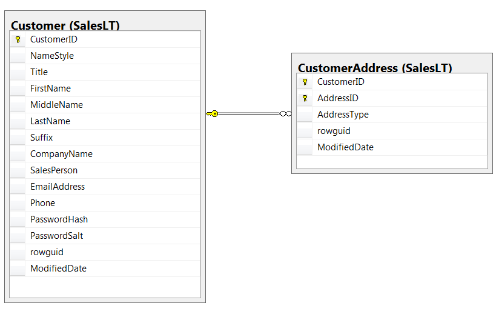

##  Spark RDDs Vs DataFrames vs SparkSQL - Part 4 : Set Operators 

This is the fourth tutorial on the Spark RDDs Vs DataFrames vs SparkSQL blog post series. The first one is available [here](http://datascience-enthusiast.com/Python/DataFramesVsRDDsSpark-Part1.html). In the first part, we saw how to retrieve, sort and filter data using Spark RDDs, DataFrames and SparkSQL. In the second part [(here)](http://datascience-enthusiast.com/Python/DataFramesVsRDDsVsSQLSpark-Part2.html), we saw how to work with multiple tables in Spark the RDD way, the DataFrame way and with SparkSQL. In the third part [(available here)](http://datascience-enthusiast.com/Python/DataFramesVsRDDsVsSQLSpark-Part3.html) of the blog post series, we performed web server log analysis using real-world text-based production logs. In this fourth part, we will see set operators in Spark the RDD way, the DataFrame way and the SparkSQL way.

Also, check out my other recent blog posts with Spark on [Analyzing the Bible and the Quran using Spark](http://datascience-enthusiast.com/Python/analyzing_bible_quran_with_spark.html) and [Spark DataFrames: Exploring Chicago Crimes](http://datascience-enthusiast.com/Python/SparkDataFrames-ExploringChicagoCrimes.html). 

The data and the notebooks can be downloaded from my [GitHub repository](https://github.com/fissehab/Spark_certification).

The three types of set operators in RDD, DataFrame and SQL approach are shown below.

**RDD**

- union

- intersection

- subtract

**DataFrame**
- unionAll

- intersect 

- subtract

**SparkSQL**

- union all

- intersect

- except

The inputs set operations expect have to have the same variables (columns).

For this tutorial, we will work with the  **SalesLTCustomer.txt**, and **SalesLTCustomerAddress.txt** datasets. Let's answer a couple of questions using Spark Resilient Distiributed (RDD) way, DataFrame way and SparkSQL by employing set operators.




```python
from pyspark import SparkContext, SparkConf
from pyspark.sql import SQLContext


conf = SparkConf().setAppName("RDD Vs DataFrames Vs SparkSQL -part 4").setMaster("local[*]")
sc = SparkContext.getOrCreate(conf)

sqlcontext = SQLContext(sc)
```

### Create RDD


```python
customer = sc.textFile("SalesLTCustomer.txt")
customer_address = sc.textFile("SalesLTCustomerAddress.txt")
```

#### Understand the data


```python
customer.first()
```


    'CustomerID\tNameStyle\tTitle\tFirstName\tMiddleName\tLastName\tSuffix\tCompanyName\tSalesPerson\tEmailAddress\tPhone\tPasswordHash\tPasswordSalt\trowguid\tModifiedDate'


```python
customer_address.first()
```


    'CustomerID\tAddressID\tAddressType\trowguid\tModifiedDate'


As shown above, the data is tab delimited.

#### Remove the header from the RDD


```python
customer_header = customer.first()
customer_rdd = customer.filter(lambda line: line != customer_header)

customer_address_header = customer_address.first()
customer_address_rdd = (customer_address.filter(lambda line: line != customer_address_header))                     
```

####  Create DataFrames,  understand the schema and show sample data


```python
customer_df = sqlcontext.createDataFrame(customer_rdd.map(lambda line: line.split("\t")),
                                         schema = customer_header.split("\t") )
```


```python
customer_df.printSchema()
```

    root
     |-- CustomerID: string (nullable = true)
     |-- NameStyle: string (nullable = true)
     |-- Title: string (nullable = true)
     |-- FirstName: string (nullable = true)
     |-- MiddleName: string (nullable = true)
     |-- LastName: string (nullable = true)
     |-- Suffix: string (nullable = true)
     |-- CompanyName: string (nullable = true)
     |-- SalesPerson: string (nullable = true)
     |-- EmailAddress: string (nullable = true)
     |-- Phone: string (nullable = true)
     |-- PasswordHash: string (nullable = true)
     |-- PasswordSalt: string (nullable = true)
     |-- rowguid: string (nullable = true)
     |-- ModifiedDate: string (nullable = true)
    


```python
customer_df.select(['CustomerID','FirstName','MiddleName','LastName','CompanyName']).show(10, truncate = False)
```

    +----------+---------+----------+----------+--------------------------+
    |CustomerID|FirstName|MiddleName|LastName  |CompanyName               |
    +----------+---------+----------+----------+--------------------------+
    |1         |Orlando  |N.        |Gee       |A Bike Store              |
    |2         |Keith    |NULL      |Harris    |Progressive Sports        |
    |3         |Donna    |F.        |Carreras  |Advanced Bike Components  |
    |4         |Janet    |M.        |Gates     |Modular Cycle Systems     |
    |5         |Lucy     |NULL      |Harrington|Metropolitan Sports Supply|
    |6         |Rosmarie |J.        |Carroll   |Aerobic Exercise Company  |
    |7         |Dominic  |P.        |Gash      |Associated Bikes          |
    |10        |Kathleen |M.        |Garza     |Rural Cycle Emporium      |
    |11        |Katherine|NULL      |Harding   |Sharp Bikes               |
    |12        |Johnny   |A.        |Caprio    |Bikes and Motorbikes      |
    +----------+---------+----------+----------+--------------------------+
    only showing top 10 rows
    


```python
customer_address_df = sqlcontext.createDataFrame(customer_address_rdd.map(lambda line: line.split("\t")), 
                                                 schema = customer_address_header.split("\t") )
```


```python
customer_address_df.printSchema()
```

    root
     |-- CustomerID: string (nullable = true)
     |-- AddressID: string (nullable = true)
     |-- AddressType: string (nullable = true)
     |-- rowguid: string (nullable = true)
     |-- ModifiedDate: string (nullable = true)
    


```python
customer_address_df.show(10, truncate = False)
```

    +----------+---------+-----------+------------------------------------+-----------------------+
    |CustomerID|AddressID|AddressType|rowguid                             |ModifiedDate           |
    +----------+---------+-----------+------------------------------------+-----------------------+
    |29485     |1086     |Main Office|16765338-DBE4-4421-B5E9-3836B9278E63|2003-09-01 00:00:00.000|
    |29486     |621      |Main Office|22B3E910-14AF-4ED5-8B4D-23BBE757414D|2001-09-01 00:00:00.000|
    |29489     |1069     |Main Office|A095C88B-D7E6-4178-A078-2ECA44214801|2001-07-01 00:00:00.000|
    |29490     |887      |Main Office|F12E1702-D897-4035-B614-0FE2C72168A9|2002-09-01 00:00:00.000|
    |29492     |618      |Main Office|5B3B3EB2-3F43-47ED-A20C-23697DABF23B|2002-12-01 00:00:00.000|
    |29494     |537      |Main Office|492D92B6-31AF-47EA-8E00-7C11C7CCC20D|2001-09-01 00:00:00.000|
    |29496     |1072     |Main Office|0A66B0F3-24BC-4148-9661-26E935CEC99A|2003-09-01 00:00:00.000|
    |29497     |889      |Main Office|7E0B56FD-7324-4898-BEDB-2F56A843BB0F|2001-07-01 00:00:00.000|
    |29499     |527      |Main Office|C90CB0C3-976A-4075-A2B9-13136F4F1A92|2002-09-01 00:00:00.000|
    |29502     |893      |Main Office|8ACB1C6A-7CDF-417B-AFD5-9F4C642F3C7E|2003-07-01 00:00:00.000|
    +----------+---------+-----------+------------------------------------+-----------------------+
    only showing top 10 rows
    


#### Register the DataFrames as Tables so as to excute SQL over the tables


```python
customer_df.createOrReplaceTempView("customer_table")
customer_address_df.createOrReplaceTempView("customer_address_table")
```

### 1. Retrieve customers with only a main office address
    Write a query that returns the company name of each company that appears in a table of customers with a ‘Main Office’ address, but not in a table of customers with a ‘Shipping’ address.

**SparkSQL way**


```python
sql1 = sqlcontext.sql("SELECT c.CompanyName \
                FROM customer_table AS c INNER JOIN customer_address_table AS ca \
                ON c.CustomerID = ca.CustomerID INNER JOIN sales_address_table AS sa \
                ON ca.AddressID = sa.AddressID\
                WHERE ca.AddressType = 'Main Office'\
                EXCEPT\
                SELECT c.CompanyName \
                FROM customer_table AS c INNER JOIN customer_address_table AS ca \
                ON c.CustomerID = ca.CustomerID INNER JOIN sales_address_table AS sa \
                ON ca.AddressID = sa.AddressID\
                WHERE ca.AddressType = 'Shipping' ORDER BY CompanyName")
sql1.show(5, truncate = False)
```

    +--------------------------+
    |CompanyName               |
    +--------------------------+
    |A Bike Store              |
    |A Great Bicycle Company   |
    |A Typical Bike Shop       |
    |Acceptable Sales & Service|
    |Action Bicycle Specialists|
    +--------------------------+
    only showing top 5 rows
    


** DataFrame way**


```python
df1 = ( (
         customer_df.join(customer_address_df.filter(customer_address_df.AddressType == 'Main Office'),
                          'CustomerID', 'inner')
         .join(sales_address_df, "AddressID", 'inner').select("CompanyName")
        )

        .subtract

        (
            (customer_df.join(customer_address_df.filter(customer_address_df.AddressType == 'Shipping'),
                              'CustomerID', 'inner')
             .join(sales_address_df, "AddressID", 'inner').select("CompanyName")
            )
        )
    ).orderBy('CompanyName')

df1.show(5, truncate = False)
```

    +--------------------------+
    |CompanyName               |
    +--------------------------+
    |A Bike Store              |
    |A Great Bicycle Company   |
    |A Typical Bike Shop       |
    |Acceptable Sales & Service|
    |Action Bicycle Specialists|
    +--------------------------+
    only showing top 5 rows
    


**RDD way**


```python
rdd1 = (
           (customer_rdd.map(lambda line: (line.split("\t")[0],line.split("\t")[7]))

           .join(
             customer_address_rdd.filter(lambda line: line.split("\t")[2] =='Main Office')
             .map(lambda line: (line.split("\t")[0], (line.split("\t")[1], 
                                                             line.split("\t")[2])))
               )
            .map(lambda line: line[1][0]).distinct()

              )
         .subtract(
                (customer_rdd.map(lambda line: (line.split("\t")[0],line.split("\t")[7]))

            .join(
                 customer_address_rdd.filter(lambda line: line.split("\t")[2] =='Shipping')
                 .map(lambda line: (line.split("\t")[0], (line.split("\t")[1], 
                                                                 line.split("\t")[2])))
                 )
             .map(lambda line: line[1][0]).distinct()

              )
           )
        ).collect()
```


```python
sorted(rdd1)[:5]
```


    ['A Bike Store',
     'A Great Bicycle Company',
     'A Typical Bike Shop',
     'Acceptable Sales & Service',
     'Action Bicycle Specialists']


We see that the first five companies from the SparkSQL way, RDD way and DataFrame way are the same but let's compare all the results.

The results from the SQL and DataFrame are of type **pyspark.sql.types.Row**. So, let's make them orginary Python lists.


```python
df1.collect()[:5]
```


    [Row(CompanyName='A Bike Store'),
     Row(CompanyName='A Great Bicycle Company'),
     Row(CompanyName='A Typical Bike Shop'),
     Row(CompanyName='Acceptable Sales & Service'),
     Row(CompanyName='Action Bicycle Specialists')]


```python
df = [i[0] for i in  df1.collect()]
df[:5]
```


    ['A Bike Store',
     'A Great Bicycle Company',
     'A Typical Bike Shop',
     'Acceptable Sales & Service',
     'Action Bicycle Specialists']


```python
sql1.collect()[:5]
```


    [Row(CompanyName='A Bike Store'),
     Row(CompanyName='A Great Bicycle Company'),
     Row(CompanyName='A Typical Bike Shop'),
     Row(CompanyName='Acceptable Sales & Service'),
     Row(CompanyName='Action Bicycle Specialists')]


```python
sql = [i[0] for i in  sql1.collect()]
sql[:5]
```


    ['A Bike Store',
     'A Great Bicycle Company',
     'A Typical Bike Shop',
     'Acceptable Sales & Service',
     'Action Bicycle Specialists']


Now, let's see if they have the same length.


```python
[len(sql), len(rdd1), len(df)]
```


    [396, 396, 396]


Next, let's check if they have the same elements. First, we have to soft our lists.


```python
sorted(sql) ==sorted(rdd1)
```


    True


```python
sorted(sql) ==sorted(df)
```


    True


```python
sorted(df) ==sorted(rdd1)
```


    True


Therefore, we see that the results from the SparkSQL appraoch, DataFrame approach and RDD approach are the same.

**2.Retrieve only customers with both a main office address and a shipping address**

Write a query that returns the company name of each company that appears in a table of customers with a ‘Main Office’ address, and also in a table of customers with a ‘Shipping’ address.

**SparkSQL way**


```python
sqlcontext.sql("SELECT c.CompanyName \
                FROM customer_table AS c INNER JOIN customer_address_table AS ca \
                ON c.CustomerID = ca.CustomerID\
                WHERE ca.AddressType = 'Main Office'\
                INTERSECT\
                SELECT c.CompanyName \
                FROM customer_table AS c INNER JOIN customer_address_table AS ca \
                ON c.CustomerID = ca.CustomerID \
                WHERE ca.AddressType = 'Shipping'ORDER BY CompanyName").show(truncate = False)
```

    +---------------------------+
    |CompanyName                |
    +---------------------------+
    |All Cycle Shop             |
    |Center Cycle Shop          |
    |Elite Bikes                |
    |Family's Favorite Bike Shop|
    |Hardware Components        |
    |Modular Cycle Systems      |
    |Progressive Sports         |
    |Racing Toys                |
    |Safe Cycles Shop           |
    |Sample Bike Store          |
    +---------------------------+
    


There are only ten companies that have ‘Main Office’ address and ‘Shipping’ address.

**DataFrame way**


```python
(  (customer_df.join(customer_address_df.filter(customer_address_df.AddressType == 'Main Office'),
                          'CustomerID', 'inner')
         .select("CompanyName")
    )

    .intersect

    (

    customer_df.join(customer_address_df.filter(customer_address_df.AddressType == 'Shipping'),
                      'CustomerID', 'inner')
     .select("CompanyName")
    )
   .orderBy("CompanyName")
   .show(truncate = False)
)
```

    +---------------------------+
    |CompanyName                |
    +---------------------------+
    |All Cycle Shop             |
    |Center Cycle Shop          |
    |Elite Bikes                |
    |Family's Favorite Bike Shop|
    |Hardware Components        |
    |Modular Cycle Systems      |
    |Progressive Sports         |
    |Racing Toys                |
    |Safe Cycles Shop           |
    |Sample Bike Store          |
    +---------------------------+
    


As shown above, the results from the SparkSQL approach and DataFrame approach are the same.

**RDD way**


```python
result = (
           (customer_rdd.map(lambda line: (line.split("\t")[0],line.split("\t")[7]))

           .join(
             customer_address_rdd.filter(lambda line: line.split("\t")[2] =='Main Office')
             .map(lambda line: (line.split("\t")[0], (line.split("\t")[1], 
                                                             line.split("\t")[2])))
               )
            .map(lambda line: line[1][0])

              )
         .intersection(
                (customer_rdd.map(lambda line: (line.split("\t")[0],line.split("\t")[7]))

            .join(
                 customer_address_rdd.filter(lambda line: line.split("\t")[2] =='Shipping')
                 .map(lambda line: (line.split("\t")[0], (line.split("\t")[1], 
                                                                 line.split("\t")[2])))
                 )
             .map(lambda line: line[1][0])

              )
    
           )

        ).collect()

sorted(result)
```


    ['All Cycle Shop',
     'Center Cycle Shop',
     'Elite Bikes',
     "Family's Favorite Bike Shop",
     'Hardware Components',
     'Modular Cycle Systems',
     'Progressive Sports',
     'Racing Toys',
     'Safe Cycles Shop',
     'Sample Bike Store']


The results from the RDD way are also the same to the DataFrame way and the SparkSQL way.

####  This is enough for today. In the next part of the Spark RDDs Vs DataFrames vs SparkSQL tutorial series, I will come with a different topic. If you have any questions, or suggestions, feel free to drop them below.
