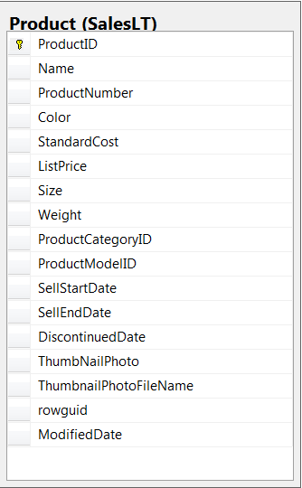
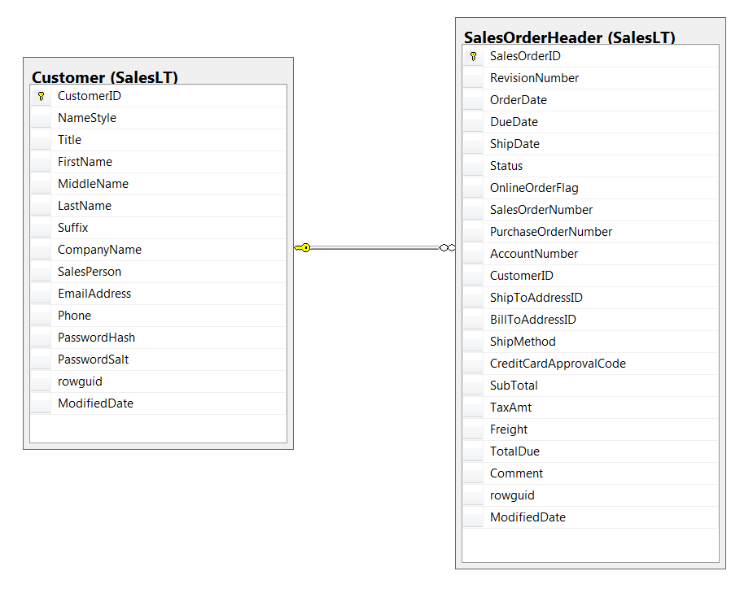
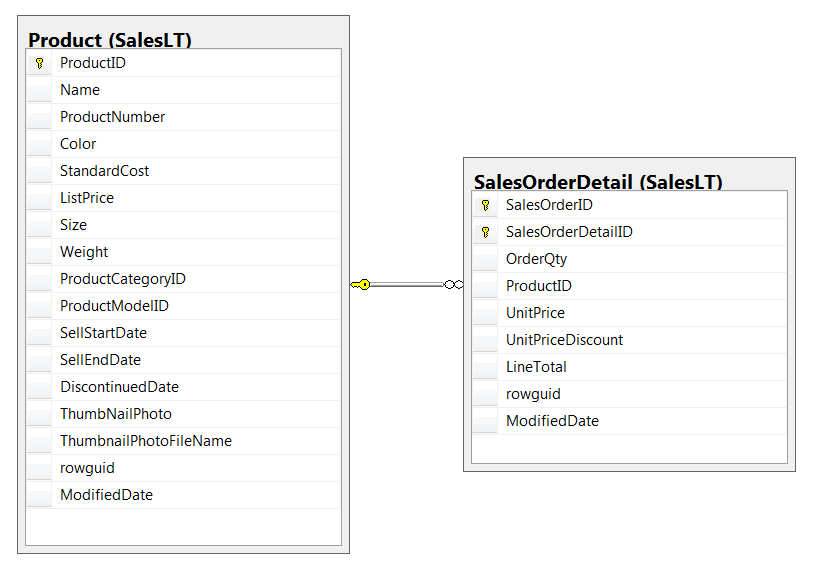

### Spark RDDs Vs DataFrames vs SparkSQL - Part 5: Using Functions

This is the ffith tutorial on the Spark RDDs Vs DataFrames vs SparkSQL blog post series. The first one is available [here](http://datascience-enthusiast.com/Python/DataFramesVsRDDsSpark-Part1.html). In the first part, we saw how to retrieve, sort and filter data using Spark RDDs, DataFrames and SparkSQL. In the second part [(here)](http://datascience-enthusiast.com/Python/DataFramesVsRDDsVsSQLSpark-Part2.html), we saw how to work with multiple tables in Spark the RDD way, the DataFrame way and with SparkSQL. In the third part [(available here)](http://datascience-enthusiast.com/Python/DataFramesVsRDDsVsSQLSpark-Part3.html) of the blog post series, we performed web server log analysis using real-world text-based production logs. In the fourth part [(available here)](http://datascience-enthusiast.com/Python/hivesparkpython.html), we saw set operators in Spark the RDD way, the DataFrame way and the SparkSQL way. In this part, we will see how to use functions (scalar, aggerage and window functions). 

Also, check out my other recent blog posts on Spark on [Analyzing the Bible and the Quran using Spark](http://datascience-enthusiast.com/Python/analyzing_bible_quran_with_spark.html), [Spark DataFrames: Exploring Chicago Crimes](http://datascience-enthusiast.com/Python/SparkDataFrames-ExploringChicagoCrimes.html) and [Leveraging Hive with Spark using Python](http://datascience-enthusiast.com/Python/hivesparkpython.html).

The data and the notebooks can be downloaded from my [GitHub repository](https://github.com/fissehab/Spark_certification).


```python
from pyspark import SparkContext, SparkConf

conf = SparkConf().setMaster("local[*]")
sc = SparkContext.getOrCreate(conf)
```


```python
from pyspark.sql import SparkSession
spark = SparkSession.builder.getOrCreate()
```

**1. Changing a string to uppercase and rounding off a numeric field **

Write a query to return the product name formatted as upper case and the weight of each product rounded to the nearest whole unit.




**RDD way**

Here, we use Python's  [built-in](https://docs.python.org/2/library/functions.html) functions **round, int, float** and the string method **str.upper()**.


```python
rdd = sc.textFile("SalesLTProduct.txt")
header = rdd.first()
content = rdd.filter(lambda line: line != header)\
          .filter(lambda line: line.split('\t')[7] != 'NULL')\ 
          .map(lambda line : (line.split('\t')[1].upper(), int(round(float(line.split('\t')[7]), 0))))
        
content.takeOrdered(10, lambda x: -x[1])
```


    [('TOURING-3000 BLUE, 62', 13608),
     ('TOURING-3000 YELLOW, 62', 13608),
     ('TOURING-3000 BLUE, 58', 13562),
     ('TOURING-3000 YELLOW, 58', 13512),
     ('TOURING-3000 BLUE, 54', 13463),
     ('TOURING-3000 YELLOW, 54', 13345),
     ('TOURING-3000 YELLOW, 50', 13213),
     ('TOURING-3000 BLUE, 50', 13213),
     ('TOURING-3000 YELLOW, 44', 13050),
     ('TOURING-3000 BLUE, 44', 13050)]


**DataFrame way**

The functions we need from **pyspark.sql module** are imported below. **Row** can be used to create a row object by using named arguments. With **Row** we can create a DataFrame from an RDD using **toDF**. **col** returns a column based on the given column name.


```python
from pyspark.sql.functions import col, round, upper
from pyspark.sql.types import *
from pyspark.sql import Row
```


```python
df = rdd.filter(lambda line: line != header)\
          .filter(lambda line: line.split('\t')[7] != 'NULL')\
          .map(lambda line : Row(Name = line.split('\t')[1], Weight = line.split('\t')[7])).toDF()
        
        
df.withColumn("ApproxWeight", round(col("Weight").cast(DoubleType()), 0).cast(IntegerType()))\
.withColumn('Name',upper(col('Name'))).orderBy('ApproxWeight', ascending = False).show(10, truncate = False)
```

    +-----------------------+--------+------------+
    |Name                   |Weight  |ApproxWeight|
    +-----------------------+--------+------------+
    |TOURING-3000 YELLOW, 62|13607.70|13608       |
    |TOURING-3000 BLUE, 62  |13607.70|13608       |
    |TOURING-3000 BLUE, 58  |13562.34|13562       |
    |TOURING-3000 YELLOW, 58|13512.45|13512       |
    |TOURING-3000 BLUE, 54  |13462.55|13463       |
    |TOURING-3000 YELLOW, 54|13344.62|13345       |
    |TOURING-3000 BLUE, 50  |13213.08|13213       |
    |TOURING-3000 YELLOW, 50|13213.08|13213       |
    |TOURING-3000 BLUE, 44  |13049.78|13050       |
    |TOURING-3000 YELLOW, 44|13049.78|13050       |
    +-----------------------+--------+------------+
    only showing top 10 rows
    


**SQL way**

To perform SQL operations, we have to first register our dataframe as a temporary table. We can use **registerTempTable** or **createOrReplaceTempView** to register our dataframe as a temporary table with the provided name.


```python
df.createOrReplaceTempView('df_table')
```


```python
spark.sql('select  upper(Name), int(round(Weight)) as ApproxWeight\
      from df_table order by ApproxWeight desc limit 10').show(10, truncate = False)
```

    +-----------------------+------------+
    |upper(Name)            |ApproxWeight|
    +-----------------------+------------+
    |TOURING-3000 BLUE, 62  |13608       |
    |TOURING-3000 YELLOW, 62|13608       |
    |TOURING-3000 BLUE, 58  |13562       |
    |TOURING-3000 YELLOW, 58|13512       |
    |TOURING-3000 BLUE, 54  |13463       |
    |TOURING-3000 YELLOW, 54|13345       |
    |TOURING-3000 BLUE, 50  |13213       |
    |TOURING-3000 YELLOW, 50|13213       |
    |TOURING-3000 YELLOW, 44|13050       |
    |TOURING-3000 BLUE, 44  |13050       |
    +-----------------------+------------+
    


**2. Retrieve the year and month in which products were first sold **

Get the year and month in which Adventure Works started selling each product. 

**RDD way**

Let's use the datetime Python package to parse the dates and times column. Since we do not need the time, let's exclude tha and work with the string part that includes the year, month and day. Once we parse the date, we can use the **year** and **month** attributes to get the year and month in which each product started selling.


```python
from datetime import datetime

def get_year(x):
     return datetime.strptime(x[:10], '%Y-%m-%d').year
    
def get_month(x):
        return datetime.strptime(x[:10], '%Y-%m-%d').month
```


```python
content = rdd.filter(lambda line: line != header)\
          .filter(lambda line: line.split('\t')[7] != 'NULL')\
          .map(lambda line : (line.split('\t')[1].upper(), int(round(float(line.split('\t')[7]), 0)),
                              line.split('\t')[10], get_year(line.split('\t')[10]),  get_month(line.split('\t')[10])))
        
content.takeOrdered(10, lambda x: -x[1])
```


    [('TOURING-3000 BLUE, 62', 13608, '2003-07-01 00:00:00.000', 2003, 7),
     ('TOURING-3000 YELLOW, 62', 13608, '2003-07-01 00:00:00.000', 2003, 7),
     ('TOURING-3000 BLUE, 58', 13562, '2003-07-01 00:00:00.000', 2003, 7),
     ('TOURING-3000 YELLOW, 58', 13512, '2003-07-01 00:00:00.000', 2003, 7),
     ('TOURING-3000 BLUE, 54', 13463, '2003-07-01 00:00:00.000', 2003, 7),
     ('TOURING-3000 YELLOW, 54', 13345, '2003-07-01 00:00:00.000', 2003, 7),
     ('TOURING-3000 YELLOW, 50', 13213, '2003-07-01 00:00:00.000', 2003, 7),
     ('TOURING-3000 BLUE, 50', 13213, '2003-07-01 00:00:00.000', 2003, 7),
     ('TOURING-3000 YELLOW, 44', 13050, '2003-07-01 00:00:00.000', 2003, 7),
     ('TOURING-3000 BLUE, 44', 13050, '2003-07-01 00:00:00.000', 2003, 7)]


**DataFrame way**

We can use the above python function to use with DataFrames by using the **udf** pyspark.sql functions.


```python
from pyspark.sql.functions import udf

year_udf  = udf(get_year, IntegerType())
month_udf  = udf(get_month, IntegerType())

df = rdd.filter(lambda line: line != header)\
          .filter(lambda line: line.split('\t')[7] != 'NULL')\
          .map(lambda line : Row(Name = line.split('\t')[1], Weight = line.split('\t')[7],
                                SellStartDate = line.split('\t')[10])).toDF()
        
        
df.withColumn("ApproxWeight", round(col("Weight").cast(DoubleType()), 0).cast(IntegerType()))\
.withColumn('Name',upper(col('Name'))).withColumn('SellStartYear',year_udf(col('SellStartDate')))\
.withColumn('SellStartMonth',month_udf(col('SellStartDate'))).orderBy('ApproxWeight', ascending = False).show(10, truncate = False)
```

    +-----------------------+-----------------------+--------+------------+-------------+--------------+
    |Name                   |SellStartDate          |Weight  |ApproxWeight|SellStartYear|SellStartMonth|
    +-----------------------+-----------------------+--------+------------+-------------+--------------+
    |TOURING-3000 YELLOW, 62|2003-07-01 00:00:00.000|13607.70|13608       |2003         |7             |
    |TOURING-3000 BLUE, 62  |2003-07-01 00:00:00.000|13607.70|13608       |2003         |7             |
    |TOURING-3000 BLUE, 58  |2003-07-01 00:00:00.000|13562.34|13562       |2003         |7             |
    |TOURING-3000 YELLOW, 58|2003-07-01 00:00:00.000|13512.45|13512       |2003         |7             |
    |TOURING-3000 BLUE, 54  |2003-07-01 00:00:00.000|13462.55|13463       |2003         |7             |
    |TOURING-3000 YELLOW, 54|2003-07-01 00:00:00.000|13344.62|13345       |2003         |7             |
    |TOURING-3000 BLUE, 50  |2003-07-01 00:00:00.000|13213.08|13213       |2003         |7             |
    |TOURING-3000 YELLOW, 50|2003-07-01 00:00:00.000|13213.08|13213       |2003         |7             |
    |TOURING-3000 BLUE, 44  |2003-07-01 00:00:00.000|13049.78|13050       |2003         |7             |
    |TOURING-3000 YELLOW, 44|2003-07-01 00:00:00.000|13049.78|13050       |2003         |7             |
    +-----------------------+-----------------------+--------+------------+-------------+--------------+
    only showing top 10 rows
    


**SQL way**

Let's register our table as a temporary table and then we can use **year** and **month** Hive functions to get the year and month in which the product was started selling.


```python
df.createOrReplaceTempView('df_table2')
```


```python
df.printSchema()
```

    root
     |-- Name: string (nullable = true)
     |-- SellStartDate: string (nullable = true)
     |-- Weight: string (nullable = true)
    


```python
spark.sql('select  upper(Name) as Name, int(round(Weight)) as ApproxWeight, SellStartDate,\
      year(SellStartDate) as SellStartYear, month(SellStartDate) as SellStartMonth\
     from df_table2 order by ApproxWeight desc limit 10').show(10, truncate = False)
```

    +-----------------------+------------+-----------------------+-------------+--------------+
    |Name                   |ApproxWeight|SellStartDate          |SellStartYear|SellStartMonth|
    +-----------------------+------------+-----------------------+-------------+--------------+
    |TOURING-3000 YELLOW, 62|13608       |2003-07-01 00:00:00.000|2003         |7             |
    |TOURING-3000 BLUE, 62  |13608       |2003-07-01 00:00:00.000|2003         |7             |
    |TOURING-3000 BLUE, 58  |13562       |2003-07-01 00:00:00.000|2003         |7             |
    |TOURING-3000 YELLOW, 58|13512       |2003-07-01 00:00:00.000|2003         |7             |
    |TOURING-3000 BLUE, 54  |13463       |2003-07-01 00:00:00.000|2003         |7             |
    |TOURING-3000 YELLOW, 54|13345       |2003-07-01 00:00:00.000|2003         |7             |
    |TOURING-3000 BLUE, 50  |13213       |2003-07-01 00:00:00.000|2003         |7             |
    |TOURING-3000 YELLOW, 50|13213       |2003-07-01 00:00:00.000|2003         |7             |
    |TOURING-3000 BLUE, 44  |13050       |2003-07-01 00:00:00.000|2003         |7             |
    |TOURING-3000 YELLOW, 44|13050       |2003-07-01 00:00:00.000|2003         |7             |
    +-----------------------+------------+-----------------------+-------------+--------------+
    


**3. String Extraction**

The leftmost two characters show the product type. Now, let's extract the first two characters and include to our previous query.

**RDD way**


```python
rdd = sc.textFile("SalesLTProduct.txt")
header = rdd.first()
content = rdd.filter(lambda line: line != header)\
          .filter(lambda line: line.split('\t')[7] != 'NULL')\
          .map(lambda line : (line.split('\t')[1].upper(), line.split('\t')[2][:2], int(round(float(line.split('\t')[7]), 0)),
                              line.split('\t')[10], get_year(line.split('\t')[10]),  get_month(line.split('\t')[10])))
        
content.takeOrdered(10, lambda x: -x[2])
```


    [('TOURING-3000 BLUE, 62', 'BK', 13608, '2003-07-01 00:00:00.000', 2003, 7),
     ('TOURING-3000 YELLOW, 62', 'BK', 13608, '2003-07-01 00:00:00.000', 2003, 7),
     ('TOURING-3000 BLUE, 58', 'BK', 13562, '2003-07-01 00:00:00.000', 2003, 7),
     ('TOURING-3000 YELLOW, 58', 'BK', 13512, '2003-07-01 00:00:00.000', 2003, 7),
     ('TOURING-3000 BLUE, 54', 'BK', 13463, '2003-07-01 00:00:00.000', 2003, 7),
     ('TOURING-3000 YELLOW, 54', 'BK', 13345, '2003-07-01 00:00:00.000', 2003, 7),
     ('TOURING-3000 YELLOW, 50', 'BK', 13213, '2003-07-01 00:00:00.000', 2003, 7),
     ('TOURING-3000 BLUE, 50', 'BK', 13213, '2003-07-01 00:00:00.000', 2003, 7),
     ('TOURING-3000 YELLOW, 44', 'BK', 13050, '2003-07-01 00:00:00.000', 2003, 7),
     ('TOURING-3000 BLUE, 44', 'BK', 13050, '2003-07-01 00:00:00.000', 2003, 7)]


**DataFrame**

The below simple **udf** helps to extract the first two letters.


```python
left_two = udf(lambda x: x[:2])
```


```python
df  =  rdd.filter(lambda line: line != header)\
          .filter(lambda line: line.split('\t')[7] != 'NULL')\
          .map(lambda line : Row(Name = line.split('\t')[1], ProductNumber = line.split('\t')[2], 
                                 Weight = line.split('\t')[7],
                                SellStartDate = line.split('\t')[10])).toDF()
        
        
df.withColumn("ApproxWeight", round(col("Weight").cast(DoubleType()), 0).cast(IntegerType()))\
.withColumn('ProductNumber', left_two(col('ProductNumber')))\
.withColumn('Name',upper(col('Name'))).withColumn('SellStartYear',year_udf(col('SellStartDate')))\
.withColumn('SellStartMonth', month_udf(col('SellStartDate'))).orderBy('ApproxWeight', ascending = False).show(10, truncate = False)
```

    +-----------------------+-------------+-----------------------+--------+------------+-------------+--------------+
    |Name                   |ProductNumber|SellStartDate          |Weight  |ApproxWeight|SellStartYear|SellStartMonth|
    +-----------------------+-------------+-----------------------+--------+------------+-------------+--------------+
    |TOURING-3000 BLUE, 62  |BK           |2003-07-01 00:00:00.000|13607.70|13608       |2003         |7             |
    |TOURING-3000 YELLOW, 62|BK           |2003-07-01 00:00:00.000|13607.70|13608       |2003         |7             |
    |TOURING-3000 BLUE, 58  |BK           |2003-07-01 00:00:00.000|13562.34|13562       |2003         |7             |
    |TOURING-3000 YELLOW, 58|BK           |2003-07-01 00:00:00.000|13512.45|13512       |2003         |7             |
    |TOURING-3000 BLUE, 54  |BK           |2003-07-01 00:00:00.000|13462.55|13463       |2003         |7             |
    |TOURING-3000 YELLOW, 54|BK           |2003-07-01 00:00:00.000|13344.62|13345       |2003         |7             |
    |TOURING-3000 YELLOW, 50|BK           |2003-07-01 00:00:00.000|13213.08|13213       |2003         |7             |
    |TOURING-3000 BLUE, 50  |BK           |2003-07-01 00:00:00.000|13213.08|13213       |2003         |7             |
    |TOURING-3000 BLUE, 44  |BK           |2003-07-01 00:00:00.000|13049.78|13050       |2003         |7             |
    |TOURING-3000 YELLOW, 44|BK           |2003-07-01 00:00:00.000|13049.78|13050       |2003         |7             |
    +-----------------------+-------------+-----------------------+--------+------------+-------------+--------------+
    only showing top 10 rows
    


**SQL**

We can use the Hive function substr to extract the first two letters. Let's first see what this function does.


```python
spark.sql('describe function substr').show(truncate = False)
```

    +------------------------------------------------------------------------------------------------------------------------------------------------------------------------------------+
    |function_desc                                                                                                                                                                       |
    +------------------------------------------------------------------------------------------------------------------------------------------------------------------------------------+
    |Function: substr                                                                                                                                                                    |
    |Class: org.apache.spark.sql.catalyst.expressions.Substring                                                                                                                          |
    |Usage: substr(str, pos[, len]) - Returns the substring of `str` that starts at `pos` and is of length `len`, or the slice of byte array that starts at `pos` and is of length `len`.|
    +------------------------------------------------------------------------------------------------------------------------------------------------------------------------------------+
    


Now, let's register our table as a temporary table and perform our SQL operations.


```python
df.createOrReplaceTempView('df_table3')
```


```python
spark.sql('select  upper(Name) as Name, substr(ProductNumber, 1, 2) as ProductNumber,  int(round(Weight)) as ApproxWeight, SellStartDate,\
      year(SellStartDate) as SellStartYear, month(SellStartDate) as SellStartMonth\
     from df_table3 order by ApproxWeight desc limit 10').show(10, truncate = False)
```

    +-----------------------+-------------+------------+-----------------------+-------------+--------------+
    |Name                   |ProductNumber|ApproxWeight|SellStartDate          |SellStartYear|SellStartMonth|
    +-----------------------+-------------+------------+-----------------------+-------------+--------------+
    |TOURING-3000 BLUE, 62  |BK           |13608       |2003-07-01 00:00:00.000|2003         |7             |
    |TOURING-3000 YELLOW, 62|BK           |13608       |2003-07-01 00:00:00.000|2003         |7             |
    |TOURING-3000 BLUE, 58  |BK           |13562       |2003-07-01 00:00:00.000|2003         |7             |
    |TOURING-3000 YELLOW, 58|BK           |13512       |2003-07-01 00:00:00.000|2003         |7             |
    |TOURING-3000 BLUE, 54  |BK           |13463       |2003-07-01 00:00:00.000|2003         |7             |
    |TOURING-3000 YELLOW, 54|BK           |13345       |2003-07-01 00:00:00.000|2003         |7             |
    |TOURING-3000 BLUE, 50  |BK           |13213       |2003-07-01 00:00:00.000|2003         |7             |
    |TOURING-3000 YELLOW, 50|BK           |13213       |2003-07-01 00:00:00.000|2003         |7             |
    |TOURING-3000 YELLOW, 44|BK           |13050       |2003-07-01 00:00:00.000|2003         |7             |
    |TOURING-3000 BLUE, 44  |BK           |13050       |2003-07-01 00:00:00.000|2003         |7             |
    +-----------------------+-------------+------------+-----------------------+-------------+--------------+
    


**4. Retrieve only products with a numeric size**

The size field can be numeric such as 48, 58, etc or it can be letters such as M for medium, S for short and L for Large. Now, let's extend our query to filter the product returned so that only products with a numeric size are included.

**RDD way**

There could be different ways of doing this but I am using the **re** module to use regular expression matching. I personally prefer regular expressions because they help to solve a wider set of problems.


```python
import re

def isNumeric(x):
    return bool(re.match('[0-9]', x))


                
content = rdd.filter(lambda line: line != header)\
          .filter(lambda line: line.split('\t')[7] != 'NULL')\
          .filter(lambda line: isNumeric(line.split('\t')[6]))\
          .map(lambda line : (line.split('\t')[1].upper(), line.split('\t')[2][:2], \
                              int(round(float(line.split('\t')[7]), 0)), line.split('\t')[6], \
                              get_year(line.split('\t')[10]),  get_month(line.split('\t')[10])))
        
content.takeOrdered(10, lambda x: -x[2])
```


    [('TOURING-3000 BLUE, 62', 'BK', 13608, '62', 2003, 7),
     ('TOURING-3000 YELLOW, 62', 'BK', 13608, '62', 2003, 7),
     ('TOURING-3000 BLUE, 58', 'BK', 13562, '58', 2003, 7),
     ('TOURING-3000 YELLOW, 58', 'BK', 13512, '58', 2003, 7),
     ('TOURING-3000 BLUE, 54', 'BK', 13463, '54', 2003, 7),
     ('TOURING-3000 YELLOW, 54', 'BK', 13345, '54', 2003, 7),
     ('TOURING-3000 YELLOW, 50', 'BK', 13213, '50', 2003, 7),
     ('TOURING-3000 BLUE, 50', 'BK', 13213, '50', 2003, 7),
     ('TOURING-3000 YELLOW, 44', 'BK', 13050, '44', 2003, 7),
     ('TOURING-3000 BLUE, 44', 'BK', 13050, '44', 2003, 7)]


We change a Python function to a user defined function (UDF) by passing the output data type.


```python
is_Numeric = udf(isNumeric, BooleanType() )

df  =  rdd.filter(lambda line: line != header)\
           .filter(lambda line: line.split('\t')[7] != 'NULL')\
           .map(lambda line : Row(Name = line.split('\t')[1], ProductNumber = line.split('\t')[2],  
                                  size = line.split('\t')[6], Weight = line.split('\t')[7],
                                SellStartDate = line.split('\t')[10])).toDF()
        
        
df.withColumn("ApproxWeight", round(col("Weight").cast(DoubleType()), 0).cast(IntegerType()))\
.filter(is_Numeric(col('size')))\
.withColumn('ProductNumber', left_two(col('ProductNumber')))\
.withColumn('Name',upper(col('Name'))).withColumn('SellStartYear',year_udf(col('SellStartDate')))\
.withColumn('SellStartMonth', month_udf(col('SellStartDate'))).orderBy('ApproxWeight', ascending = False).show(10, truncate = False)
```

    +-----------------------+-------------+-----------------------+--------+----+------------+-------------+--------------+
    |Name                   |ProductNumber|SellStartDate          |Weight  |size|ApproxWeight|SellStartYear|SellStartMonth|
    +-----------------------+-------------+-----------------------+--------+----+------------+-------------+--------------+
    |TOURING-3000 YELLOW, 62|BK           |2003-07-01 00:00:00.000|13607.70|62  |13608       |2003         |7             |
    |TOURING-3000 BLUE, 62  |BK           |2003-07-01 00:00:00.000|13607.70|62  |13608       |2003         |7             |
    |TOURING-3000 BLUE, 58  |BK           |2003-07-01 00:00:00.000|13562.34|58  |13562       |2003         |7             |
    |TOURING-3000 YELLOW, 58|BK           |2003-07-01 00:00:00.000|13512.45|58  |13512       |2003         |7             |
    |TOURING-3000 BLUE, 54  |BK           |2003-07-01 00:00:00.000|13462.55|54  |13463       |2003         |7             |
    |TOURING-3000 YELLOW, 54|BK           |2003-07-01 00:00:00.000|13344.62|54  |13345       |2003         |7             |
    |TOURING-3000 BLUE, 50  |BK           |2003-07-01 00:00:00.000|13213.08|50  |13213       |2003         |7             |
    |TOURING-3000 YELLOW, 50|BK           |2003-07-01 00:00:00.000|13213.08|50  |13213       |2003         |7             |
    |TOURING-3000 BLUE, 44  |BK           |2003-07-01 00:00:00.000|13049.78|44  |13050       |2003         |7             |
    |TOURING-3000 YELLOW, 44|BK           |2003-07-01 00:00:00.000|13049.78|44  |13050       |2003         |7             |
    +-----------------------+-------------+-----------------------+--------+----+------------+-------------+--------------+
    only showing top 10 rows
    


**SQL**


```python
df.createOrReplaceTempView('df_table4')
```

In Hive to check weather a field is numeric or not is to cast that column to numeric and see if the output is numeric. Non-numeric fields will be NULL and we can easily filter them aout as shown below.


```python
spark.sql('select  upper(Name) as Name,  substr(ProductNumber, 1, 2) as ProductNumber, size, int(round(Weight)) as ApproxWeight, SellStartDate,\
      year(SellStartDate) as SellStartYear, month(SellStartDate) as SellStartMonth\
     from df_table4 where cast(size as double) is not null order by ApproxWeight desc limit 10').show(10, truncate = False)
```

    +-----------------------+-------------+----+------------+-----------------------+-------------+--------------+
    |Name                   |ProductNumber|size|ApproxWeight|SellStartDate          |SellStartYear|SellStartMonth|
    +-----------------------+-------------+----+------------+-----------------------+-------------+--------------+
    |TOURING-3000 YELLOW, 62|BK           |62  |13608       |2003-07-01 00:00:00.000|2003         |7             |
    |TOURING-3000 BLUE, 62  |BK           |62  |13608       |2003-07-01 00:00:00.000|2003         |7             |
    |TOURING-3000 BLUE, 58  |BK           |58  |13562       |2003-07-01 00:00:00.000|2003         |7             |
    |TOURING-3000 YELLOW, 58|BK           |58  |13512       |2003-07-01 00:00:00.000|2003         |7             |
    |TOURING-3000 BLUE, 54  |BK           |54  |13463       |2003-07-01 00:00:00.000|2003         |7             |
    |TOURING-3000 YELLOW, 54|BK           |54  |13345       |2003-07-01 00:00:00.000|2003         |7             |
    |TOURING-3000 BLUE, 50  |BK           |50  |13213       |2003-07-01 00:00:00.000|2003         |7             |
    |TOURING-3000 YELLOW, 50|BK           |50  |13213       |2003-07-01 00:00:00.000|2003         |7             |
    |TOURING-3000 BLUE, 44  |BK           |44  |13050       |2003-07-01 00:00:00.000|2003         |7             |
    |TOURING-3000 YELLOW, 44|BK           |44  |13050       |2003-07-01 00:00:00.000|2003         |7             |
    +-----------------------+-------------+----+------------+-----------------------+-------------+--------------+
    


**5. Window Functions**

Let's use Spark SQL and DataFrame APIs ro retrieve companies ranked by sales totals from the SalesOrderHeader and SalesLTCustomer tables. We will display the first 10 rows from the solution using each method to just compare our answers to make sure we are doing it right.



```python
orderHeader = sc.textFile("SalesLTSalesOrderHeader.txt")

header = orderHeader.first()

orderHeader_rdd =   orderHeader.filter(lambda line: line != header)

orderHeader_df = orderHeader_rdd.map(lambda line: Row(CustomerID = line.split('\t')[10],
                                                     TotalDue = float(line.split('\t')[-4] ))).toDF()
```


```python
customer = sc.textFile("SalesLTCustomer.txt")

header = customer.first()

customer_rdd =   customer.filter(lambda line: line != header)
customer_df = customer_rdd.map(lambda line: Row(CustomerID = line.split('\t')[0],
                                            CompanyName = line.split('\t')[7])).toDF()
```


```python
customer_df.printSchema()
```

    root
     |-- CompanyName: string (nullable = true)
     |-- CustomerID: string (nullable = true)
    


```python
orderHeader_df.printSchema()
```

    root
     |-- CustomerID: string (nullable = true)
     |-- TotalDue: double (nullable = true)
    


**DataFrame way**

**rank** returns the rank of rows within a window partition. We use **Window** to specify the columns for partitioning and ordering.


```python
from pyspark.sql.functions import col
from pyspark.sql.functions import rank
from pyspark.sql.window import Window
```


```python
windowspecs = Window.orderBy(-col('TotalDue'))
df = customer_df.join(orderHeader_df, 'CustomerID','inner')\
.select('CompanyName','TotalDue')

df.withColumn('rank', rank().over(windowspecs)).show(10, truncate = False)
```

    +------------------------------+-----------+----+
    |CompanyName                   |TotalDue   |rank|
    +------------------------------+-----------+----+
    |Action Bicycle Specialists    |119960.824 |1   |
    |Metropolitan Bicycle Supply   |108597.9536|2   |
    |Bulk Discount Store           |98138.2131 |3   |
    |Eastside Department Store     |92663.5609 |4   |
    |Riding Cycles                 |86222.8072 |5   |
    |Many Bikes Store              |81834.9826 |6   |
    |Instruments and Parts Company |70698.9922 |7   |
    |Extreme Riding Supplies       |63686.2708 |8   |
    |Trailblazing Sports           |45992.3665 |9   |
    |Professional Sales and Service|43962.7901 |10  |
    +------------------------------+-----------+----+
    only showing top 10 rows
    


**SQL**

Here, we can use the normal SQL rank function.


```python
customer_df.createOrReplaceTempView('customer_table')
orderHeader_df.createOrReplaceTempView('orderHeader_table')
```


```python
spark.sql('select c.CompanyName, o.TotalDue,\
Rank() OVER (ORDER BY TotalDue DESC ) AS RankByRevenue FROM customer_table AS c \
INNER JOIN orderHeader_table AS o ON c.CustomerID = o.CustomerID').show(10, truncate = False)
```

    +------------------------------+-----------+-------------+
    |CompanyName                   |TotalDue   |RankByRevenue|
    +------------------------------+-----------+-------------+
    |Action Bicycle Specialists    |119960.824 |1            |
    |Metropolitan Bicycle Supply   |108597.9536|2            |
    |Bulk Discount Store           |98138.2131 |3            |
    |Eastside Department Store     |92663.5609 |4            |
    |Riding Cycles                 |86222.8072 |5            |
    |Many Bikes Store              |81834.9826 |6            |
    |Instruments and Parts Company |70698.9922 |7            |
    |Extreme Riding Supplies       |63686.2708 |8            |
    |Trailblazing Sports           |45992.3665 |9            |
    |Professional Sales and Service|43962.7901 |10           |
    +------------------------------+-----------+-------------+
    only showing top 10 rows
    


**6. Write a query to retrieve a list of the product names and the total revenue calculated as the sum of the LineTotal from the SalesLT.SalesOrderDetail table, with the results sorted in descending order of total revenue.**





Let's display 10 records from each method to compare the answers.


**RDD way**


```python
orderDetail = sc.textFile("SalesLTSalesOrderDetail.txt")

header1 = orderDetail.first()

orderDetail_rdd = orderDetail.filter(lambda line: line != header1 )\
                  .map(lambda line: (line.split('\t')[3], float(line.split('\t')[6])))


product = sc.textFile("SalesLTProduct.txt")
header2 = product.first()

product_rdd = product.filter(lambda line: line != header2)\
            .map(lambda line: (line.split('\t')[0], (line.split('\t')[1], float(line.split('\t')[5]))))
```


```python
product_rdd.join(orderDetail_rdd)\
.map(lambda line: (line[1][0][0],line[1][1]))\
.reduceByKey(lambda a, b: a+b)\
.sortBy(lambda x: -x[1])\
.take(10)
```


    [('Touring-1000 Blue, 60', 37191.492),
     ('Mountain-200 Black, 42', 37178.838),
     ('Road-350-W Yellow, 48', 36486.2355),
     ('Mountain-200 Black, 38', 35801.844),
     ('Touring-1000 Yellow, 60', 23413.474656),
     ('Touring-1000 Blue, 50', 22887.072),
     ('Mountain-200 Silver, 42', 20879.91),
     ('Road-350-W Yellow, 40', 20411.88),
     ('Mountain-200 Black, 46', 19277.916),
     ('Road-350-W Yellow, 42', 18692.519308)]


**DataFrame way**


```python
orderDetail_df = orderDetail.filter(lambda line: line != header1 )\
                             .map(lambda line: Row(ProductID = line.split('\t')[3],
                                                 LineTotal = float(line.split('\t')[6]))).toDF()

product_df = product.filter(lambda line: line != header2)\
                     .map(lambda line: Row(ProductID = line.split('\t')[0], 
                                             Name = line.split('\t')[1],
                                             ListPrice = float(line.split('\t')[5]))).toDF()
```


```python
orderDetail_df.printSchema()
```

    root
     |-- LineTotal: double (nullable = true)
     |-- ProductID: string (nullable = true)
    


```python
product_df.printSchema()
```

    root
     |-- ListPrice: double (nullable = true)
     |-- Name: string (nullable = true)
     |-- ProductID: string (nullable = true)
    


```python
product_df.join(orderDetail_df,'ProductID','inner')\
.groupBy('Name').agg({'LineTotal':'sum'}).orderBy('sum(LineTotal)', ascending = False)\
.show(10, truncate = False)
```

    +-----------------------+--------------+
    |Name                   |sum(LineTotal)|
    +-----------------------+--------------+
    |Touring-1000 Blue, 60  |37191.492     |
    |Mountain-200 Black, 42 |37178.838     |
    |Road-350-W Yellow, 48  |36486.2355    |
    |Mountain-200 Black, 38 |35801.844     |
    |Touring-1000 Yellow, 60|23413.474656  |
    |Touring-1000 Blue, 50  |22887.072     |
    |Mountain-200 Silver, 42|20879.91      |
    |Road-350-W Yellow, 40  |20411.88      |
    |Mountain-200 Black, 46 |19277.916     |
    |Road-350-W Yellow, 42  |18692.519308  |
    +-----------------------+--------------+
    only showing top 10 rows
    


**SQL**


```python
orderDetail_df.createOrReplaceTempView('orderDetail_table')
product_df.createOrReplaceTempView('product_df_table')
```


```python
spark.sql('SELECT Name,SUM(LineTotal) AS TotalRevenue FROM product_df_table AS p \
INNER JOIN orderDetail_table AS o ON o.ProductID = p.ProductID \
GROUP BY Name ORDER BY TotalRevenue DESC').show(10, truncate = False)
```

    +-----------------------+------------+
    |Name                   |TotalRevenue|
    +-----------------------+------------+
    |Touring-1000 Blue, 60  |37191.492   |
    |Mountain-200 Black, 42 |37178.838   |
    |Road-350-W Yellow, 48  |36486.2355  |
    |Mountain-200 Black, 38 |35801.844   |
    |Touring-1000 Yellow, 60|23413.474656|
    |Touring-1000 Blue, 50  |22887.072   |
    |Mountain-200 Silver, 42|20879.91    |
    |Road-350-W Yellow, 40  |20411.88    |
    |Mountain-200 Black, 46 |19277.916   |
    |Road-350-W Yellow, 42  |18692.519308|
    +-----------------------+------------+
    only showing top 10 rows
    


**7. Modify the previous query to include sales totals for products that have a list price of more than $1000.**

**RDD way**


```python
orderDetail = sc.textFile("SalesLTSalesOrderDetail.txt")

header1 = orderDetail.first()

orderDetail_rdd = orderDetail.filter(lambda line: line != header1 )\
                  .map(lambda line: (line.split('\t')[3], float(line.split('\t')[6])))


product = sc.textFile("SalesLTProduct.txt")
header2 = product.first()

product_rdd = product.filter(lambda line: line != header2)\
              .filter(lambda line: float(line.split('\t')[5]) > 1000)\
              .map(lambda line: (line.split('\t')[0], (line.split('\t')[1], float(line.split('\t')[5]))))
```


```python
rdd_answer = product_rdd.join(orderDetail_rdd)\
.map(lambda line: (line[1][0][0],line[1][1]))\
.reduceByKey(lambda a, b: a + b)\
.sortBy(lambda x: -x[1])
```

**DataFrame way**


```python
orderDetail_df = orderDetail.filter(lambda line: line != header1 )\
                             .map(lambda line: Row(ProductID = line.split('\t')[3],
                                                 LineTotal = float(line.split('\t')[6]))).toDF()

product_df = product.filter(lambda line: line != header2)\
                     .map(lambda line: Row(ProductID = line.split('\t')[0], 
                                             Name = line.split('\t')[1],
                                             ListPrice = float(line.split('\t')[5]))).toDF()
```


```python
df_answer = product_df.filter(product_df.ListPrice > 1000)\
           .join(orderDetail_df,'ProductID','inner')\
           .groupBy('Name').agg({'LineTotal':'sum'}).orderBy('sum(LineTotal)', ascending = False)
```

**SQL**


```python
sql_answer = spark.sql('SELECT Name,SUM(LineTotal) AS TotalRevenue FROM product_df_table AS p \
INNER JOIN orderDetail_table AS o ON o.ProductID = p.ProductID \
WHERE p.ListPrice > 1000 GROUP BY Name ORDER BY TotalRevenue DESC')
```

**8. Filter the product sales groups to include only total sales over 20,000
Modify the previous query to only include only product groups with a total sales value greater than 20,000 dollars.**

**RDD way**


```python
for i in rdd_answer.filter(lambda line: line[1] > 20000).collect():
  print(i)
    
```

    ('Touring-1000 Blue, 60', 37191.492)
    ('Mountain-200 Black, 42', 37178.838)
    ('Road-350-W Yellow, 48', 36486.2355)
    ('Mountain-200 Black, 38', 35801.844)
    ('Touring-1000 Yellow, 60', 23413.474656)
    ('Touring-1000 Blue, 50', 22887.072)
    ('Mountain-200 Silver, 42', 20879.91)
    ('Road-350-W Yellow, 40', 20411.88)


**DataFrame**


```python
for i in df_answer.filter(df_answer['sum(LineTotal)'] > 20000).collect():
    print((i[0],i[1]))
```

    ('Touring-1000 Blue, 60', 37191.492)
    ('Mountain-200 Black, 42', 37178.838)
    ('Road-350-W Yellow, 48', 36486.2355)
    ('Mountain-200 Black, 38', 35801.844)
    ('Touring-1000 Yellow, 60', 23413.474656)
    ('Touring-1000 Blue, 50', 22887.072)
    ('Mountain-200 Silver, 42', 20879.91)
    ('Road-350-W Yellow, 40', 20411.88)


**SQL**


```python
spark.sql('SELECT Name,SUM(LineTotal) AS TotalRevenue FROM product_df_table AS p \
INNER JOIN orderDetail_table AS o ON o.ProductID = p.ProductID \
WHERE p.ListPrice > 1000 GROUP BY Name \
HAVING SUM(LineTotal) > 20000 ORDER BY TotalRevenue DESC').show(truncate = False)
```

    +-----------------------+------------+
    |Name                   |TotalRevenue|
    +-----------------------+------------+
    |Touring-1000 Blue, 60  |37191.492   |
    |Mountain-200 Black, 42 |37178.838   |
    |Road-350-W Yellow, 48  |36486.2355  |
    |Mountain-200 Black, 38 |35801.844   |
    |Touring-1000 Yellow, 60|23413.474656|
    |Touring-1000 Blue, 50  |22887.072   |
    |Mountain-200 Silver, 42|20879.91    |
    |Road-350-W Yellow, 40  |20411.88    |
    +-----------------------+------------+
    


We see that the answers from the three approaches are the same.

**This is enough for today. See you in the next part of the Spark with Python tutorial series.**
